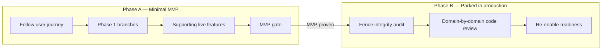
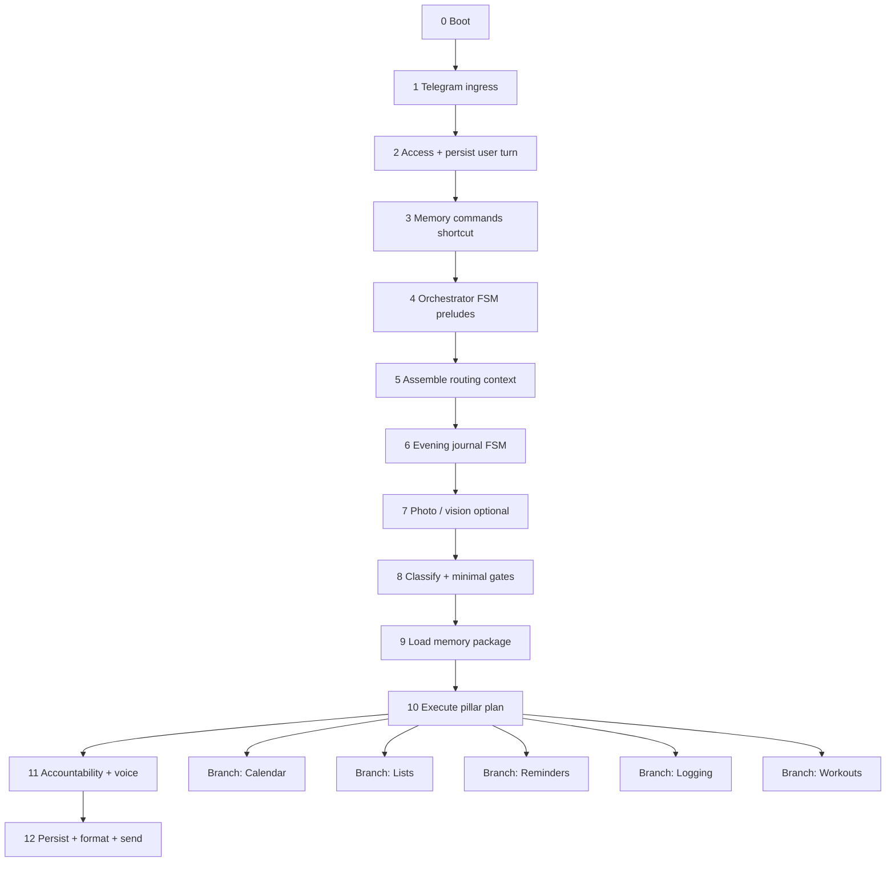
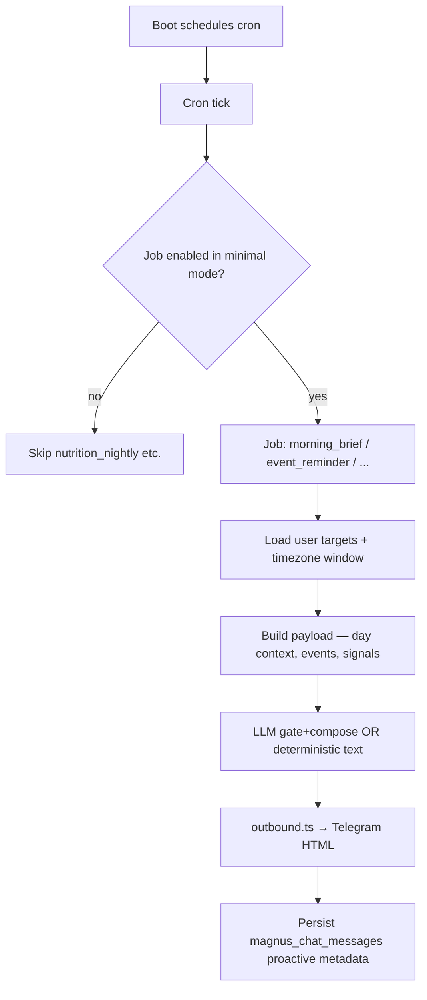
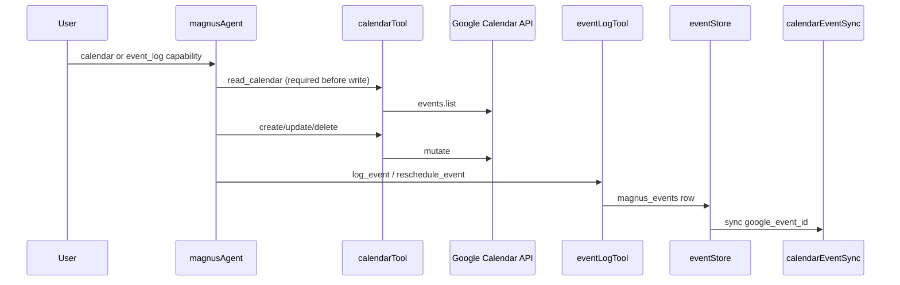
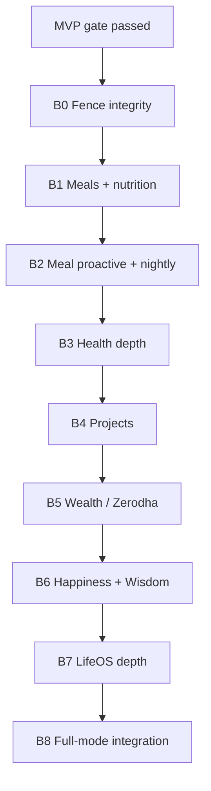

# Magnus review plan (minimal mode user journey)

**This is the only review plan.** Index: [`README.md`](./README.md).  
**Purpose:** Review Magnus in **two phases** — first perfect **minimal MVP** (live paths only), then review **parked code still in production** once MVP is proven.  
**Companion:** `MINIMAL_MODE_MODULE_MAP.md` (module inventory), `docs/product/MINIMAL_MODE_FOCUS.md` (product scope)  
**Last updated:** 2026-09-12

---

## Two-phase strategy



| Phase | Goal | What we review | What we skip |
|-------|------|----------------|--------------|
| **A — Minimal MVP** | Minimal mode works great end-to-end | Every code path a user can hit in production today | Deep line review of gated-off domains |
| **B — Parked in production** | Code in the deployed binary is correct, fenced, and ready when we flip flags | Meals, nutrition, pillars, projects, meal proactive, etc. | Re-architecting minimal paths (frozen after Phase A) |

**Rule:** Do not start Phase B until **MVP gate** (below) passes. Phase A fixes the maze the user actually walks; Phase B inventories and tightens corridors that exist but are roped off.

### Logs

| Log file | Phase | Contents |
|----------|-------|----------|
| `docs/review/MINIMAL_MODE_JOURNEY_LOG.md` | A | Per-session traces, issues, optimizations |
| `docs/review/MINIMAL_MODE_PARKED_LOG.md` | B | Per-domain fence checks, re-enable blockers |

---

## How to use this plan (both phases)

There are **two runtime journeys** (Phase A):

| Journey | Trigger | Entry point |
|---------|---------|-------------|
| **Reactive** | User sends Telegram message/photo | `tools/telegram.ts` |
| **Proactive** | Cron or scheduled subscription fires | `proactive/cron.ts` |

For each **stage** or **session**, we:

1. **Trace** — what code runs, in what order, what data passes between modules  
2. **Diagram** — one small sequence or flowchart for that stage  
3. **Review** — read every file in the file list line by line  
4. **Optimize** — redundancies, wrong order, leaks, missing gates, slow paths  
5. **Exit criteria** — what must be true before advancing  

---

# Phase A — Minimal MVP (live functioning only)

**Scope:** Everything reachable when `MAGNUS_MINIMAL_MODE=true` (default in production).

### Phase A — in scope

| Bucket | Includes |
|--------|----------|
| **Ingress + spine** | Stages 0–12 (boot → Telegram → orchestrator → reply) |
| **Phase 1 domains** | Workouts, calendar, lists, reminders, logging (branches B1–B5) |
| **Supporting live** | YouTube, morning brief, day overview, pillar consultation (Health only), conversation, memory commands |
| **Proactive (live)** | 6 jobs + 10 subscription kinds in `MINIMAL_PROACTIVE_*` |
| **Fence (shallow)** | Confirm parked paths return `parkedFeatureReply` — **no execution** (one session, not deep domain review) |

### Phase A — explicitly out of scope

- Line-by-line review of `meals/`, `nutrition/`, wealth/happiness/wisdom agents, `projects/` executors
- Meal proactive kinds, `nutrition_nightly` job, health onboarding flow
- Schema/migration design for Phase 2 tables (unless a live path is broken)
- Deploy/ops (`Dockerfile`, Railway) except boot reliability (stage 0)

---

## Master map — reactive journey (user message → reply)



---

## Master map — proactive journey (no user turn)



---

# Journey A — Reactive (inbound)

---

## Stage 0 — Process boot

**User experience:** Nothing visible; bot becomes reachable.

| Step | Module | What happens |
|------|--------|--------------|
| 0.1 | `index.ts` | Load env, log capabilities, create Magnus runtime, Telegram runtime, health HTTP, watchdog |
| 0.2 | `magnus.ts` `createMagnus()` | `scheduleProactiveCron()` |
| 0.3 | `config/magnusCapabilities.ts` | Boot log includes `minimalModeLogFields()` |
| 0.4 | `healthServer.ts` | `/health`, `/ready`, OAuth callbacks, webhook mount |

**Files to review (in order):**

```
index.ts
env.ts
logger.ts
magnus.ts                    (createMagnus only)
config/magnusCapabilities.ts
config/minimalMode.ts        (isMinimalMode, log fields)
healthServer.ts
tools/clients.ts             (Supabase + Redis)
proactive/cron.ts            (schedule only)
proactive/registry.ts        (job list + minimal filter)
```

**Talks to:** Supabase (clients), Redis, Telegram API (later), Express.

**Optimize for:**

- Minimal mode reported correctly at boot (`minimalMode: true`, focus areas)
- Only minimal proactive jobs registered as enabled
- No full-mode-only services started accidentally

**Exit criteria:**

- [ ] `npm run telegram:check` shows minimal scope
- [ ] Cron lists only `MINIMAL_PROACTIVE_JOBS` when `MAGNUS_MINIMAL_MODE=true`

---

## Stage 1 — Telegram ingress

**User experience:** Message hits bot; duplicates ignored; rate limit enforced; `/start` `/help` answered instantly.

| Step | Module | What happens |
|------|--------|--------------|
| 1.1 | `tools/telegram.ts` | Webhook or long-poll receives update |
| 1.2 | `claimTelegramUpdate` | Redis `SET NX` on `update_id` (24h TTL) |
| 1.3 | Local shortcuts | `/start`, `/help` → `telegramIntro.ts` (no model) |
| 1.4 | Morning brief trigger | `morningBriefManual.ts` — bypasses orchestrator |
| 1.5 | `checkMessageRateLimit` | Redis fixed window per user |
| 1.6 | Photo handler | Largest photo → `mealPhoto` passed to handler |
| 1.7 | `index.ts` callback | → `handleMessage()` |

**Files:**

```
tools/telegram.ts
tools/rateLimit.ts
config/telegramRuntime.ts
config/telegramCommands.ts
magnus/telegramIntro.ts
proactive/morningBriefManual.ts
config/security.ts             (redis fail-open for dedupe)
```

**Data passed forward:**

```ts
handleMessage(text, telegramUserId, { updateId, sendTyping, mealPhoto? })
```

**Optimize for:**

- Dedupe before any DB write
- Minimal-mode intro text matches live features
- Morning brief path consistent with cron brief (same builder)
- Photo path: non-meal photos reach vision; meal photos will be parked later

**Exit criteria:**

- [ ] Duplicate webhook retry never double-replies
- [ ] Rate limit message is user-safe
- [ ] `/start` and `/help` never call orchestrator

---

## Stage 2 — Access gate + persist user turn

**User experience:** Non-allowlisted users get refusal; allowlisted users' message saved; typing indicator starts.

| Step | Module | What happens |
|------|--------|--------------|
| 2.1 | `tools/chatLog.ts` | `resolveTelegramUserProfile(telegramUserId)` |
| 2.2 | `magnus.ts` | `allowlisted`, `access_flags.chat` gates |
| 2.3 | `recordMagnusChatMessage` | User row → `magnus_chat_messages` |
| 2.4 | Typing interval | Refresh every 4.5s until reply |

**Files:**

```
magnus.ts                      (handleMessage: gates + persist)
tools/chatLog.ts
tools/chatMessageTypes.ts
```

**Talks to:** `user_profile` (Supabase), `magnus_chat_messages`.

**Optimize for:**

- Profile auto-create vs provision flow documented
- Failed persist still attempts reply (warn log only)
- Timeout copy differs in minimal mode (`turn_timeout` message)

**Exit criteria:**

- [ ] Refusal paths never call orchestrator
- [ ] Every successful turn has user row in chat log

---

## Stage 3 — Memory command shortcut

**User experience:** "Remember …", "Forget …", "What do you remember?" answered without LLM.

| Step | Module | What happens |
|------|--------|--------------|
| 3.1 | `memoryTopicCommands.ts` | Pattern match → upsert/delete/list topics |
| 3.2 | Early return | Persist assistant row, chunk HTML, send |

**Files:**

```
agents/memory/memoryTopicCommands.ts
agents/memory/memoryTopics.ts
```

**Bypasses:** Entire orchestrator.

**Exit criteria:**

- [ ] Commands never leak into classifier
- [ ] Topic writes scoped to `user_profile_id`

---

## Stage 4 — Orchestrator FSM preludes (hijack before routing)

**User experience:** Short replies when user is mid-flow (morning win, activity done?, undo).

These run **before** routing context assembly — order matters.

| Order | Prelude | File | Redis / DB state |
|-------|---------|------|------------------|
| 4.1 | Morning win condition | `jobs/handleWinConditionPending.ts` | `winConditionPending` |
| 4.2 | Activity completion | `logging/handleActivityCompletionPending.ts` | `activityCompletionPending` |
| 4.3 | Reversible undo | `routing/handleReversibleAction.ts` | `reversibleAction` |

**Files:**

```
agents/magnusOrchestrator.ts   (prelude calls only)
jobs/winConditionPending.ts
jobs/handleWinConditionPending.ts
logging/activityCompletionPending.ts
logging/handleActivityCompletionPending.ts
logging/activityCompletionParser.ts
logging/syncCalendarAfterEventReschedule.ts
routing/reversibleAction.ts
routing/handleReversibleAction.ts
```

**Talks to:** Redis (pending keys), `magnus_events` (status updates), Google Calendar (reschedule).

**Optimize for:**

- Prelude order: win → activity → undo — is it optimal?
- Activity completion updates `magnus_events` + calendar consistently
- Undo only touches last registered write
- Each prelude sets `pillar_compose: false` when deterministic

**Exit criteria:**

- [ ] "Yes" after morning brief logs intention via check-in
- [ ] Activity done/missed/skip/postpone closes event log row
- [ ] "Undo this" works without disambiguation

---

## Stage 5 — Assemble routing context (frontload)

**User experience:** Invisible; shapes classification and plan parsing.

| Step | Module | What happens |
|------|--------|--------------|
| 5.1 | `assembleRoutingContext.ts` | Parallel loads: integrations, program memory, pending FSMs, recent turns, growth snapshot |
| 5.2 | `routingContextParser.ts` | Haiku → structural signals (`prefer_intent_health`, `parked_feature_topic`, `looks_like_evening_journal`, …) |
| 5.3 | Output | `assembled` object passed to classifier + plan parser |

**Files:**

```
agents/context/assembleRoutingContext.ts
agents/context/loadGrowthSnapshot.ts
agents/context/growthHelpers.ts
agents/context/integrationRegistry.ts
agents/context/normalizeRecentTurns.ts
agents/context/formatRoutingContextForClassifier.ts
agents/routing/routingContextParser.ts
agents/routing/intentRoutingHints.ts
tools/routingContext.ts          (recent turns from chat log)
users/userIntegrations.ts
users/userProgramMemory.ts
```

**Pending state read here:**

- `activityCompletionPending`, `eveningJournalPending`, `mealLogPending` (parked path), `reversibleAction`, `projectSession` (skipped in minimal), `mealPlanSession` (parked)

**Optimize for:**

- Minimal mode: growth snapshot still loads slipping routines (adherence) — necessary?
- Parser sets `parked_feature_topic: meals` reliably
- No regex routing bypass in orchestrator (signals only)
- Context size / latency before first LLM call

**Exit criteria:**

- [ ] `assembleRoutingContext` completes without loading full memory block
- [ ] Parser signals documented and tested for minimal scenarios

---

## Stage 6 — Evening journal FSM

**User experience:** Multi-turn evening reflection; may arm from routing signal.

| Step | Module | What happens |
|------|--------|--------------|
| 6.1 | Arm | If `looks_like_evening_journal` → `armEveningJournalPendingFromUser` |
| 6.2 | Handle | `handleEveningJournalPendingTurn` — engage → collect → confirm |
| 6.3 | Save | `log_daily_checkin` + daily log status |

**Files:**

```
logging/eveningJournalPending.ts
logging/handleEveningJournalPending.ts
logging/parseEveningDraft.ts
logging/dailyLogStatus.ts
lists/listService.ts           (check-in write)
agents/tools/dailyLogReadTool.ts
```

**Runs before:** Intent classification (if pending or signal).

**Exit criteria:**

- [ ] Skip/decline sets `logging_declined` — nudges stop
- [ ] Confirm path writes check-in + updates daily status

---

## Stage 7 — Photo / vision (optional)

**User experience:** User sends photo; Magnus interprets list/schedule/doc — meal photos get parked reply.

| Step | Module | What happens |
|------|--------|--------------|
| 7.1 | `buildPhotoContext.ts` | Download + Claude vision analysis |
| 7.2 | `augmentMessageWithPhoto.ts` | Append vision summary to user message |
| 7.3 | `resolvePhotoIntent.ts` | Map purpose → intent (may force HEALTH) |
| 7.4 | Minimal gate | Meal purpose → `parkedFeatureReply("Meal photos")` in orchestrator |

**Files:**

```
vision/buildPhotoContext.ts
vision/analyzePhotoInContext.ts
vision/augmentMessageWithPhoto.ts
vision/resolvePhotoIntent.ts
vision/types.ts
meals/telegramPhotoDownload.ts   (download helper)
```

**Exit criteria:**

- [ ] List/schedule photos route to GENERAL tools
- [ ] Food photos never write `meal_logs` in minimal mode

---

## Stage 8 — Classify intent + minimal mode gates

**User experience:** Silent routing; parked pillars/meals get friendly scope message.

| Step | Module | What happens |
|------|--------|--------------|
| 8.1 | `orchestratorIntent.ts` | Sonnet classify (minimal system prompt) |
| 8.2 | Photo override | Vision may set intent before/alongside classify |
| 8.3 | `isParkedIntent` | WEALTH/HAPPINESS/WISDOM → `parkedIntentReply` |
| 8.4 | `parked_feature_topic` | meals → `parkedFeatureReply` |
| 8.5 | Health onboarding | **Skipped** when `isMinimalMode()` |

**Files:**

```
agents/orchestratorIntent.ts
intent.ts
agents/pillarPhilosophy.ts
config/minimalMode.ts          (parked replies)
agents/routing/intentToPillarRoute.ts
```

**Early exit paths:** Parked intent/topic → `finalizeOrchestratorReply` (stage 11).

**Exit criteria:**

- [ ] Classifier never required to route meals in minimal mode
- [ ] Parked replies list Phase 1 live features

---

## Stage 9 — Load memory package (post-classify)

**User experience:** Invisible; recent chat + summary + topics in agent prompt.

| Step | Module | What happens |
|------|--------|--------------|
| 9.1 | `memoryAgent.ts` | `loadMemoryContext` + `buildMemoryPackage` |
| 9.2 | `selectContextSlice.ts` | Trim for calendar/list-focused GENERAL turns (minimal-aware) |
| 9.3 | `ctx.memoryBlock` | Attached to `AgentContext` |

**Files:**

```
agents/memory/memoryAgent.ts
agents/memory/memoryPackage.ts
agents/memory/selectContextSlice.ts
agents/memory/format.ts
agents/memory/userKnowledge.ts
agents/memory/memoryTopics.ts
agents/memory/semanticMemory.ts
agents/memory/memoryEmbeddings.ts
agents/tools/recallContextTool.ts
```

**Exit criteria:**

- [ ] Memory load only after classify (not in stage 5)
- [ ] Context slice reduces tokens on calendar/list turns

---

## Stage 10 — Execute pillar plan (the fork)

**User experience:** Magnus does the thing — calendar, list, workout, etc.

### 10.0 — Common pipeline (all intents)

| Step | Module | What happens |
|------|--------|--------------|
| 10.0.1 | `parsePillarStrategy.ts` | Haiku plan: `steps[]` with capabilities |
| 10.0.2 | `filterCapabilityCatalog` | Minimal allowlist applied to catalogs |
| 10.0.3 | `executePillarPlan.ts` | Sequential steps → optional `composePillarPlanReply` |
| 10.0.4 | `executePlanStep.ts` | Dispatch to pillar-specific executor |

**Files (shared):**

```
agents/routing/pillarStrategy/parsePillarStrategy.ts
agents/routing/pillarStrategy/executePillarPlan.ts
agents/routing/pillarStrategy/executePlanStep.ts
agents/routing/pillarStrategy/composePillarPlanReply.ts
agents/routing/pillarStrategy/buildRoutingHints.ts
agents/routing/pillarStrategy/buildStepAgentContext.ts
agents/routing/pillarStrategy/catalogs/index.ts
agents/routing/pillarStrategy/catalogs/generalCatalog.ts
agents/routing/pillarStrategy/catalogs/healthCatalog.ts
```

### 10A — GENERAL branch

```
magnusOrchestrator → executeGeneralStrategy → executeGeneralPlanStep
```

| Capability | Executor | Tools / downstream |
|------------|----------|-------------------|
| `calendar` | `runMagnusAgent` | `calendarTool.ts` → Google Calendar API |
| `event_log` | `runMagnusAgent` | `eventLogTool.ts` → `events/eventStore.ts` |
| `reminders` | `runMagnusAgent` | `manageRemindersTool.ts` → `reminderStore.ts` |
| `lists` | `runMagnusAgent` | `listTool.ts` → `lists/listService.ts` |
| `notion` | `runMagnusAgent` | `notionConnectTool.ts` → Notion OAuth |
| `journal_note` | `runMagnusAgent` | `logNoteTool.ts` → `magnus_daily_logs` |
| `daily_checkin` | `runMagnusAgent` | `dailyLogReadTool.ts`, check-in writers |
| `day_overview` | `dayOverview.ts` | `day/buildDayContext.ts` |
| `youtube` | `runMagnusAgent` | `youtubeTool.ts` |
| `pillar_consultation` | `executePillarConsultation.ts` | Magnus tools + Health only |
| `conversation` | `runMagnusAgent` | No tools / subset |

**Magnus tool loop:**

```
agents/magnusAgent.ts
  → intersectMagnusToolNames (minimal allowlist)
  → tool handlers in agents/tools/*
  → actionIntegrity records tool_outcomes
```

### 10B — HEALTH branch (minimal)

```
magnusOrchestrator → dispatchToAgent → healthRouter → executeHealthStrategy
```

| Capability | Executor | Downstream |
|------------|----------|------------|
| `fitness` | `fitnessAgent.ts` | Hevy read, weekly schedule, program memory |
| `hevy_write` | `hevyWriteAgent.ts` | `hevyClient.ts` → Hevy API |
| `journal` | `healthJournalAgent.ts` | `healthJournalStore.ts` |
| `generic_ack` | Short reply | — |
| `meal_*` etc. | **Blocked** | `parkedHealthCapabilityReply` in `executeHealthPlanStep.ts` |

**Deterministic gates (pre-parser):**

```
agents/routing/pillarStrategy/healthDeterministicGates.ts  (meal gates disabled in minimal)
agents/health/healthRouter.ts
agents/routing/pillarStrategy/executeHealthPlanStep.ts
agents/routing/pillarStrategy/executeHealthStrategy.ts
```

**Exit criteria (stage 10):**

- [ ] Plan never includes parked capabilities in minimal mode
- [ ] Tool allowlist matches `MINIMAL_MAGNUS_TOOL_NAMES`
- [ ] Multi-step plans compose to one voice

---

## Stage 10 branches — Phase 1 deep dives

Review each branch **after** stage 10 common pipeline is solid. Follow sub-stages in product priority order.

### Branch B1 — Calendar & commitments (user: "What's on tomorrow?" / "Move gym to 6pm")



**Review order:**

1. `agents/tools/calendarTool.ts` + `routing/readBeforeWrite.ts`
2. `integrations/googleCalendar/*`, `integrations/google/oauthFlow.ts`
3. `agents/tools/eventLogTool.ts`
4. `events/eventStore.ts`, `eventTypes.ts`, `eventTime.ts`, `calendarEventSync.ts`
5. `day/buildDayContext.ts`, `day/detectDayConflicts.ts`
6. `routing/pillarStrategy/dayOverview.ts`

**Optimize for:** read-before-write, linked row on calendar delete, reschedule closes old row, default `remind_at`.

---

### Branch B2 — Lists (user: "Add X to my todo list")

```
magnusAgent → listTool → listService → listStore (Supabase)
                      ↘ listNotionMirror (if connected)
```

**Review order:**

1. `agents/tools/listTool.ts`
2. `lists/listCatalog.ts`, `listSlug.ts`, `listStore.ts`, `listService.ts`
3. `lists/listNotionMirror.ts`
4. `integrations/notion/notionListSync.ts`, `notionProvision.ts`
5. `agents/tools/notionConnectTool.ts`

---

### Branch B3 — Reminders (user: "Remind me tomorrow at 8")

```
magnusAgent → manageRemindersTool → reminderStore → magnus_proactive_subscriptions
event_reminder job ← magnus_events.remind_at
```

**Review order:**

1. `proactive/manageRemindersTool.ts`
2. `proactive/reminderStore.ts`, `parseReminderTime.ts`, `reminderMatch.ts`
3. `proactive/oneShotReminderExpiry.ts`
4. `proactive/jobs/eventReminderJob.ts`
5. `proactive/kinds/customReminder.ts`

---

### Branch B4 — Logging (user: "Log a note" / evening journal / activity done)

```
log_note → logNoteTool → magnus_daily_logs (+ Notion mirror)
evening journal → logging FSM → log_daily_checkin
activity completion → update_event + calendar reschedule
morning win → winConditionPending → log_daily_checkin
```

**Review order:**

1. `agents/tools/logNoteTool.ts`
2. `logging/dailyLogStatus.ts`, `logging/types.ts`
3. `logging/handleEveningJournalPending.ts` (stage 6 overlap)
4. `logging/handleActivityCompletionPending.ts` (stage 4 overlap)
5. `jobs/handleWinConditionPending.ts`
6. `events/eventCompletionReconcile.ts`

---

### Branch B5 — Workouts (user: "How was my last leg day?" / Hevy write)

```
healthRouter → fitness / hevy_write executors
fitnessAgent → hevyClient (read) + weeklySchedule + program memory
hevyWriteAgent → hevyClient (write)
gym event ↔ Hevy: gymHevyMatch → gymHevyReconcile (proactive job)
```

**Review order:**

1. `agents/health/healthRouter.ts`
2. `pillars/health/workouts/agents/fitnessAgent.ts`
3. `pillars/health/workouts/agents/hevyWriteAgent.ts`
4. `pillars/health/workouts/hevy/*`
5. `pillars/health/workouts/weeklySchedule.ts`
6. `pillars/health/references/*`
7. `events/gymHevyMatch.ts`, `gymHevyReconcile.ts`
8. `proactive/jobs/gymHevyReconcileJob.ts`, `kinds/driftGuard.ts`

---

### Branch B6 — YouTube (user: "Add this to my wisdom playlist") — Session A12

```
magnusAgent → youtubeTool / youtubeConnectTool
           → integrations/youtube/* + youtube/youtubeStore.ts + playlistResolve.ts
```

**Review order:**

1. `agents/tools/youtubeTool.ts`, `youtubeConnectTool.ts`
2. `integrations/youtube/operations.ts`, `auth.ts`, `oauthFlow.ts`
3. `youtube/youtubeStore.ts`, `playlistResolve.ts`
4. `integrations/google/oauthFlow.ts` (shared Calendar + YouTube token)

---

### Morning brief E2E — Session A13

Three entry points must produce consistent output:

| Entry | Path |
|-------|------|
| Cron | `proactive/jobs/morningBriefJob.ts` → `jobs/morningBrief.ts` |
| Manual | `telegram.ts` → `proactive/morningBriefManual.ts` |
| Post-brief win | `jobs/handleWinConditionPending.ts` → check-in write |

**Shared builder:** `jobs/morningBriefContext.ts` → `day/buildDayContext.ts` (`includeMeals: false` in minimal).

---

### Pillar consultation — Session A14

**User:** "Pull my calendar and review today's workout."

```
executeGeneralPlanStep → executePillarConsultationStep
  → consultationMagnusTools (minimal tool subset)
  → dispatch Health + Magnus in parallel
  → consultationOutcome → composePillarPlanReply
```

**Files:** `executePillarConsultation.ts`, `consultationMagnusTools.ts`, `consultationOutcome.ts`, `agentConsultation.ts`

**Minimal constraint:** `filterConsultablePillars` → **HEALTH only**.

---

### Fence smoke — Session A15 (last Phase A session)

**Not a domain review** — confirm parked domains cannot execute:

- Sample utterances for meals, wealth, happiness, wisdom, projects, meal photos
- Assert: `parkedFeatureReply` / `parkedIntentReply`, no tool calls, no writes
- Run: `npm test -- src/config/minimalMode`, `npm run test:accuracy` (minimal cases)

Then run **MVP gate** checklist.

---

## Stage 11 — Accountability + Magnus voice (terminal)

**User experience:** One coherent reply; no false "saved" claims.

| Step | Module | What happens |
|------|--------|--------------|
| 11.1 | `accountabilityAgent.ts` | `enforceActionIntegrity`, action ledger |
| 11.2 | `finalizeMagnusVoice.ts` | Re-compose if not already done |
| 11.3 | `registerReversibleAction` | Meal undo registration (parked in minimal) |

**Files:**

```
agents/routing/accountabilityAgent.ts
agents/routing/actionIntegrity.ts
agents/routing/finalizeMagnusVoice.ts
agents/magnusOrchestrator.ts   (finalizeOrchestratorReply)
```

**Exit criteria:**

- [ ] Every orchestrator path goes through `vetAndCompose`
- [ ] `pillar_compose: false` paths skip double-compose
- [ ] Failed tools reflected in reply text

---

## Stage 12 — Persist, memory maintenance, format, send

**User experience:** Reply appears in Telegram; logged for future context.

| Step | Module | What happens |
|------|--------|--------------|
| 12.1 | `recordMagnusChatMessage` | Assistant row + metadata (`delegated_agent`, `agent_metadata`) |
| 12.2 | `postTurnMemory.ts` | Async summary + topic extract |
| 12.3 | `telegramChunk.ts` | Split for 4096 limit |
| 12.4 | `telegramFormat.ts` | Markdown-ish → Telegram HTML |
| 12.5 | `telegram.ts` | `ctx.reply` HTML |

**Files:**

```
magnus.ts                      (persist + chunk)
tools/chatLog.ts
agents/memory/postTurnMemory.ts
agents/memory/summaryBuffer.ts
magnus/telegramChunk.ts
magnus/telegramFormat.ts
```

**Exit criteria:**

- [ ] Metadata records routing for debugging
- [ ] Post-turn memory does not block reply
- [ ] HTML escaping safe for user content

---

# Journey B — Proactive (outbound)

Review after reactive stages 0–12 and branch B4 (logging) — proactive reuses day context and logging FSM.

## P-Stage 1 — Cron scheduler

**Files:** `proactive/cron.ts`, `proactive/env.ts`, `proactive/registry.ts`, `config/minimalMode.ts`

**Minimal jobs:** `morning_brief`, `event_reminder`, `activity_completion`, `gym_hevy_reconcile`, `proactive_subscriptions`, `notion_list_sync`

## P-Stage 2 — Per-job journeys

| Job | User experience | Key files |
|-----|-----------------|-----------|
| `morning_brief` | Morning focus push | `jobs/morningBrief.ts`, `morningBriefContext.ts`, `jobs/morningBriefJob.ts` |
| `event_reminder` | "Gym in 30 min" | `proactive/jobs/eventReminderJob.ts`, `events/eventStore.ts` |
| `activity_completion` | "Did you finish yoga?" | `proactive/jobs/activityCompletionJob.ts`, arms `activityCompletionPending` |
| `gym_hevy_reconcile` | Hevy matched or missed nudge | `proactive/jobs/gymHevyReconcileJob.ts`, `events/gymHevyReconcile.ts` |
| `proactive_subscriptions` | Evening journal, drift guard, … | `proactive/dispatcher.ts`, `proactive/kinds/*`, `subscriptions/store.ts` |
| `notion_list_sync` | Silent daily sync | `proactive/jobs/notionListSyncJob.ts` |

**Shared outbound:**

```
proactive/outbound.ts → outboundTelegraf.ts → Telegram
proactive/guards.ts   (quiet hours, daily cap)
proactive/llm/gateAndCompose.ts
proactive/dedupe.ts
```

## P-Stage 3 — Subscription kinds (minimal allowlist)

Review each live kind as a mini-journey: **signal → gate → compose → send → persist**.

```
evening_journal, evening_log_followup, drift_guard, custom_reminder,
week_planning, weekly_wrap, monthly_goal_review, midday_encouragement,
stale_list_nudge, chat_inactivity
```

**Files:** `proactive/kinds/<kind>.ts`, `proactive/rhythm/*`, `proactive/signals/*`

---

# Phase A — session schedule (minimal MVP)

| Session | Stages / branch | Goal |
|---------|-----------------|------|
| **A1** | 0–2 | Ingress trustworthy: dedupe, gates, persist |
| **A2** | 3–4 | Short-circuit paths: memory cmds, FSM preludes |
| **A3** | 5–8 | Routing spine: context → classify → minimal gates |
| **A4** | 9–11 | Memory + plan pipeline + accountability |
| **A5** | 12 | Outbound formatting + post-turn |
| **A6** | Branch B1 | Calendar + event log + day overview |
| **A7** | Branch B4 | Logging + closure FSMs |
| **A8** | Branch B3 | Reminders end-to-end |
| **A9** | Branch B5 | Workouts + gym ↔ Hevy |
| **A10** | Branch B2 | Lists + Notion mirror |
| **A11** | Journey B (proactive) | Live jobs + live subscription kinds |
| **A12** | Branch B6 | YouTube / YT Music |
| **A13** | Morning brief E2E | Manual trigger + cron + win loop + `buildDayContext` |
| **A14** | Pillar consultation | Health-only consultation path |
| **A15** | Fence smoke | Parked intents/topics return reply only — **no deep parked review** |

---

## MVP gate (end of Phase A)

**Do not open Phase B until every item is checked.**

### Product — Phase 1 adherence question

> Is the user sticking to their plan, or are commitments failing?

| Signal | Verified how |
|--------|----------------|
| Commitments captured | Calendar + `magnus_events` create/update/reschedule |
| Commitments closed | Activity completion FSM, gym ↔ Hevy, missed sweep |
| Daily ritual | Morning win, evening journal, `dailyLogStatus` |
| Nudges reliable | Event reminders, custom reminders, proactive kinds fire in timezone |
| Lists + mirror | CRUD works; Notion sync when connected |

### Technical gates

```bash
npm test                                    # full unit suite
npm run test:accuracy                       # minimal-mode scenarios green
npx tsx scripts/dev/import-graph.mts        # no new production orphans
npm run telegram:check                      # minimal capabilities reported
```

| Gate | Criterion |
|------|-----------|
| **Accuracy** | `npm run test:accuracy` passes; no failing `minimalModeOnly` cases |
| **Fence smoke** | WEALTH/HAPPINESS/WISDOM/meals/meal photos → parked reply, zero DB writes |
| **No regressions** | Phase A journey log: all critical issues resolved or explicitly deferred |
| **Manual smoke** | Golden paths from `docs/review/GOLDEN_PATH_TEST_RESULTS.md` for live features (or re-run subset) |
| **Owner sign-off** | You confirm MVP “feels great” in real Telegram use |

Record gate result in `MINIMAL_MODE_JOURNEY_LOG.md` → section **MVP GATE PASSED** with date.

---

# Phase B — Parked code in production

**Start only after MVP gate passes.**

### What “parked in production” means

Code is **compiled and deployed** in the same Docker image as minimal mode, but **runtime-gated** by `minimalMode.ts`, orchestrator early exits, or `isMinimalProactiveJobEnabled` / `isMinimalProactiveKindEnabled`. Phase B asks:

1. **Fence** — Can this code still execute when minimal mode is on? (must be **no**)
2. **Quality** — When we set `MAGNUS_MINIMAL_MODE=false`, is the code worth keeping?
3. **Readiness** — What must ship before re-enabling this domain?

### Phase B — review order (by re-enable sequence from product doc)

Aligns with `docs/product/MINIMAL_MODE_FOCUS.md` Phase 2 ordering.



---

## B0 — Fence integrity (whole codebase)

**Goal:** Prove minimal mode cannot accidentally execute parked domains.

| Check | How |
|-------|-----|
| Allowlists complete | `minimalMode.ts` vs all tools in `magnusAgent`, all catalog capabilities, all cron jobs/kinds |
| No bypass paths | Grep: `isMinimalMode()` guards on meal gates, project prelude, health onboarding, pillar dispatch |
| Classifier | Meal/wealth/happiness/wisdom utterances → parked reply or GENERAL fence |
| Proactive | `nutritionNightlyJob`, `meal_*` kinds, `projectConflictReview` never run when minimal |
| Accuracy suite | `minimalModeOnly` + parked-topic tests in `minimalMode.parkedTopic.test.ts` |

**Files (fence layer only — not domain depth yet):**

```
src/config/minimalMode.ts
src/agents/magnusOrchestrator.ts
src/agents/orchestratorIntent.ts
src/agents/routing/pillarStrategy/executeHealthPlanStep.ts
src/agents/routing/pillarStrategy/executeGeneralPlanStep.ts
src/agents/routing/pillarStrategy/healthDeterministicGates.ts
src/proactive/registry.ts
src/proactive/dispatcher.ts
src/proactive/manageProactiveTool.ts
src/capabilities/magnusAccuracyScenarios.ts
```

**Exit:** Document any **fence bugs** as P0 — fix in Phase A hotfix branch before continuing B1+.

---

## B1 — Meals + nutrition (~56 files)

**User journey when re-enabled:** “I ate …” → intake parser → `meal_logs` → rollups → plan vs log routing.

| Submodule | Path | ~Files |
|-----------|------|--------|
| Meal logging pipeline | `src/meals/*` | 31 |
| Nutrition stores + planning | `src/nutrition/*` | 25 |
| Health meal agents | `agents/health/meal*.ts`, `mealIntakeParserAgent.ts`, `mealPlanner*.ts`, … | ~15 |
| Meal gates | `healthDeterministicGates.ts`, `mealLogPending.ts` | 3 |
| Vision meal path | `vision/*` when `purpose=meal_log` | shared |

**Trace journey:** photo/text → `healthDeterministicGates` → `mealIntakeParserAgent` → `mealLogPipeline` → `recordMealLog` → `meal_daily_rollups`.

**Review questions:** plan vs log rules (`mealPlanVsLog.ts`), undo, slot correction, duplicate guard, compose arithmetic.

---

## B2 — Meal proactive + nutrition nightly

| Item | Path |
|------|------|
| Nightly cron | `proactive/jobs/nutritionNightlyJob.ts` |
| Meal kinds | `proactive/kinds/mealLogReminder.ts`, `mealAdherenceNudge.ts`, `mealGapNudge.ts`, `mealEodReconciliation.ts`, `weeklyNutritionReview.ts` |
| Signals | `nutrition/mealProactiveSignals.ts`, `mealReminderSchedule.ts` |

**Exit:** Re-enable checklist: env keys (USDA, CalorieNinjas), `MINIMAL_PROACTIVE_KINDS` update, morning brief meals slice.

---

## B3 — Health depth (beyond workouts)

| Item | Path |
|------|------|
| Onboarding gate | `agents/health/healthOnboarding.ts` |
| Energy / sleep | `agents/health/energyAgent.ts` |
| Long-term planning | `agents/health/longTermHealthPlanningAgent.ts` |
| Nutrition advice | `agents/health/nutritionAgent.ts`, `nutritionOrchestrated.ts` |
| Alternates | `agents/health/alternatesRecommenderAgent.ts` |
| Meal planning journey | `nutrition/planning/*`, `mealPlanningSessionStore.ts` |

**Note:** Workouts already reviewed in **A9**; B3 is everything else in `HEALTH_CAPABILITY_CATALOG`.

---

## B4 — Projects

| Item | Path |
|------|------|
| Setup FSM | `projects/projectSetupFlow.ts`, `projectSessionStore.ts` |
| Prelude hijack | `projects/projectSessionPrelude.ts` |
| Executor | `projects/projectExecutor.ts`, `projectConflictService.ts` |
| Parser | `projects/parseProjectSetupTurn.ts` |
| GENERAL capabilities | `project_setup`, `project_manage`, `project_status`, `goal_manage` |
| Proactive | `proactive/kinds/projectConflictReview.ts` |

---

## B5 — Wealth + Zerodha

| Item | Path |
|------|------|
| Wealth agent | `agents/wealth/wealthAgent.ts` |
| Kite client | `pillars/wealth/zerodha/*` |
| Connect tool | `agents/tools/kiteConnectTool.ts` |
| Execute path | `executeWealthPlanStep.ts`, `executeWealthStrategy.ts` |
| Catalog | `catalogs/wealthCatalog.ts` |

---

## B6 — Happiness + Wisdom

| Item | Path |
|------|------|
| Agents | `agents/happiness/happinessAgent.ts`, `agents/wisdom/wisdomAgent.ts` |
| Pillar specialist runner | `agents/pillarSpecialist.ts` |
| Executors | `executeHappinessPlanStep.ts`, `executeWisdomPlanStep.ts` |
| Catalogs | `happinessCatalog.ts`, `wisdomCatalog.ts` |
| Consultation | Re-enable multi-pillar `filterConsultablePillars` |

---

## B7 — LifeOS depth

| Item | Path |
|------|------|
| Joy tank, pillar status | `lifeos/lifeosStore.ts`, `lifeosTool.ts` |
| GENERAL `lifeos` capability | Parked in minimal; full reads when `MAGNUS_LIFEOS_CONTEXT_ENABLED` |
| Notion journal hub | `tools/notion.ts`, `notionMorningBrief.ts` (brief page — not list mirror) |

---

## B8 — Full-mode integration pass

**Goal:** Flip `MAGNUS_MINIMAL_MODE=false` in staging; run full journeys.

| Check | Command / doc |
|-------|----------------|
| Full accuracy | `npm run test:accuracy` (all scenarios, not only minimal) |
| Golden path | `docs/review/GOLDEN_PATH_TEST_RESULTS.md` |
| Accuracy scorecard | `docs/review/MAGNUS_ACCURACY_SCORECARD.md` |
| Manual owner sim | 7-day Telegram usage against Phase A exit criteria (this doc, MVP gate) |

---

# Phase B — session schedule

| Session | Domain | Goal |
|---------|--------|------|
| **B0** | Fence integrity | No parked execution in minimal mode |
| **B1** | Meals + nutrition | Intake → log → rollup journey sound |
| **B2** | Meal proactive | Cron + kinds ready to re-enable |
| **B3** | Health depth | Onboarding + non-workout health |
| **B4** | Projects | Setup FSM + executor |
| **B5** | Wealth | Kite read + agent |
| **B6** | Happiness + Wisdom | Prompt specialists + catalogs |
| **B7** | LifeOS | Joy tank, goals context, Notion hub |
| **B8** | Full-mode staging | End-to-end with `MAGNUS_MINIMAL_MODE=false` |

---

# Per-stage review worksheet

Copy into `MINIMAL_MODE_JOURNEY_LOG.md` (Phase A) or `MINIMAL_MODE_PARKED_LOG.md` (Phase B).

```markdown
## Session <A|B><N> — <name>

### Phase
- [ ] A — Minimal MVP  /  [ ] B — Parked in production

### Trace confirmed
- Entry:
- Exit:
- Data contracts:

### Files reviewed
- [ ] file.ts — notes

### Issues found
| ID | Severity | File:line | Issue | Proposed fix |
|----|----------|-----------|-------|--------------|
| | P0 fence | | Must fix before Phase B continues | |

### Optimizations
- Remove:
- Reorder:
- Merge:

### Exit criteria
- [ ] ...

### Tests run
- 
```

---

# Per-stage review worksheet

Copy into `MINIMAL_MODE_JOURNEY_LOG.md` for each session.

```markdown
## Session N — Stage X: <name>

### Trace confirmed
- Entry:
- Exit:
- Data contracts:

### Files reviewed
- [ ] file.ts — notes

### Issues found
| ID | Severity | File:line | Issue | Proposed fix |
|----|----------|-----------|-------|--------------|

### Optimizations
- Remove:
- Reorder:
- Merge:

### Exit criteria
- [ ] ...

### Tests run
- 
```

---

# Verification per session

### Phase A (after each session)

```bash
# Routing / fence touched
npm test -- src/agents/orchestratorIntent src/config/minimalMode

# Branch deep dive (examples)
npm test -- src/events src/logging
npm test -- src/lists src/integrations/notion

# Before MVP gate
npm run test:accuracy
npx tsx scripts/dev/import-graph.mts
```

### Phase B (after each domain)

```bash
# Domain tests
npm test -- src/meals src/nutrition          # B1
npm test -- src/projects                     # B4
npm test -- src/agents/wealth                # B5

# Re-confirm fence after parked changes
npm test -- src/config/minimalMode.parkedTopic.test.ts

# After B8
npm run test:accuracy
```

---

# Next step

**Phase A:** Start **Session A1 (Stages 0–2)** — ingress and gates.

**Phase B:** Wait for **MVP gate** — then **Session B0 (fence integrity)**.

Say **"Start A1"** or **"Start A6 (calendar)"** for minimal MVP review.  
Say **"Start B0"** only after MVP gate is recorded as passed.
