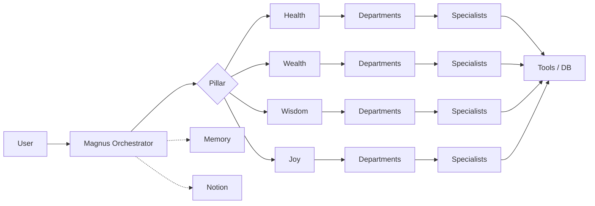
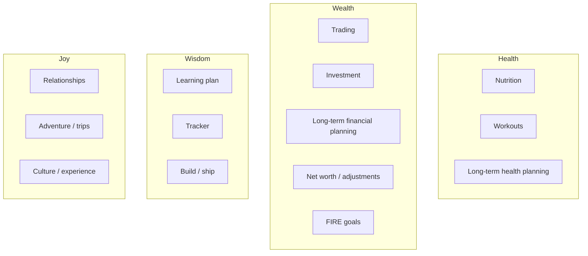

# Magnus — agentic architecture (pillars → departments → specialists)

**Purpose:** Single **target structure** for how every user query should flow: **one orchestrator**, then **one pillar**, then **one department**, then **specialist agents**. Use this when adding routes, prompts, or tools.  
**Companion docs:** `MAGNUS_CORE_CONTEXT.md` (philosophy, four pillars), `docs/AGENT_ROSTER.md` (prompts & behaviour), `magnus.md` (runtime & DB).

**Last updated:** 2026-08-09

---

## 1. Non‑negotiable routing rule

```
User message
    → Magnus Orchestrator Agent (single entry)
        → Pillar classifier (Health | Wisdom | Wealth | Joy)
            → Department router (within that pillar)
                → Specialist agent(s) (one primary; others as tools or sub-calls)
                    → Tools / APIs / DB
```

- **Every** query is parsed and owned by the **Magnus orchestrator** first (intent, memory, safety, delegation).
- The orchestrator **never** skips itself to talk to a department directly from the user’s perspective; internally it may chain specialists.
- **Memory** and **Notion / logging** are **cross-cutting** (layers around pillars), not pillars.

---

## 2. Four pillars (LifeOS alignment)

These map to the **conceptual pillars** in `MAGNUS_CORE_CONTEXT.md` (Health, Wealth, Wisdom, Joy). They are **not** identical to today’s classifier labels in `src/intent.ts` — see **§7** for a migration mapping.


| Pillar     | North-star question          | Typical user asks                                            |
| ---------- | ---------------------------- | ------------------------------------------------------------ |
| **Health** | Body, energy, longevity      | Training, food, sleep, recovery, medical-adjacent lifestyle  |
| **Wealth** | Money, optionality, FIRE     | Trading, investing, net worth, cash flow, tax-aware planning |
| **Wisdom** | Learning, craft, building    | Study plans, skills, projects, research, career architecture |
| **Joy**    | Relationships, meaning, play | People, travel, experiences, culture (books, film, poetry)   |


---

## 3. Departments per pillar

Departments are **stable buckets** inside a pillar. Routing picks **one primary department** per turn (unless the orchestrator explicitly runs a multi-step pipeline).

### 3.1 Health


| Department                    | Scope (examples)                                           |
| ----------------------------- | ---------------------------------------------------------- |
| **Nutrition**                 | Meals, macros, adherence, food strategy                    |
| **Workouts**                  | Training, cardio, strength, movement, performance          |
| **Long-term health planning** | Season plans, race prep, health span, habits over quarters |


### 3.2 Wealth


| Department                       | Scope (examples)                                        |
| -------------------------------- | ------------------------------------------------------- |
| **Trading**                      | Tactics, execution, risk, positions (when wired)        |
| **Investment**                   | Allocation, thesis, diversification, long-horizon holds |
| **Long-term financial planning** | Cash flow, milestones, scenarios                        |
| **Net worth & balance sheet**    | Snapshot, drift, adjustments, reconciliation            |
| **FIRE & independence goals**    | Targets, safe withdrawal framing, trade-offs            |


### 3.3 Wisdom


| Department                    | Scope (examples)                                        |
| ----------------------------- | ------------------------------------------------------- |
| **Learning plan development** | Curricula, milestones, spaced practice                  |
| **Tracking & habits**         | Progress, streaks, reviews (learning-specific)          |
| **Build / ship**              | Projects, deliverables, technical or creative execution |


### 3.4 Joy


| Department            | Scope (examples)                            |
| --------------------- | ------------------------------------------- |
| **Relationships**     | Family, friends, boundaries, social energy  |
| **Adventure & trips** | Planning, packing, itineraries, experiences |
| **Culture & leisure** | Movies, books, poetry, games, events        |


---

## 4. Specialist agents (examples)

Specialists are **narrow capabilities** under a department. One **department turn** may call **one primary specialist** and optionally **sub-tools** (e.g. calorie API after meal parser).

### 4.1 Health → Nutrition


| Specialist                    | Role                                                |
| ----------------------------- | --------------------------------------------------- |
| **Meal logger**               | Parse free text → structured log lines              |
| **Calorie / macro estimator** | API + scaling (e.g. CalorieNinjas, USDA), fallbacks |
| **Meal planner**              | Day/week meal ideas within constraints              |
| **Alternates recommender**    | Swaps for goals, allergies, context                 |
| **Onboarding / preferences**  | Capture diet, timing, restrictions                  |


### 4.2 Health → Workouts


| Specialist                  | Role                                  |
| --------------------------- | ------------------------------------- |
| **Workout logger / viewer** | Read recent sessions from DB          |
| **Programming coach**       | Splits, progression, deload           |
| **Recovery & energy**       | Sleep, fatigue, non-clinical patterns |


### 4.3 Wealth *(mostly future)*


| Specialist               | Role                                                      |
| ------------------------ | --------------------------------------------------------- |
| **Trading copilot**      | Journal, rules, post-mortems (no broker until integrated) |
| **Investment analyst**   | Thesis, allocation talk                                   |
| **Net-worth reconciler** | Explain drift, categories                                 |
| **FIRE modeller**        | Scenarios, savings rate, target dates                     |


### 4.4 Wisdom *(partially overlaps current “Planner” + “Research”)*


| Specialist               | Role                          |
| ------------------------ | ----------------------------- |
| **Learning planner**     | Syllabus-style plans          |
| **Tracker coach**        | Reviews, adjustments          |
| **Build / ship partner** | Scope, milestones, unblocking |


### 4.5 Joy *(mostly future)*


| Specialist              | Role                          |
| ----------------------- | ----------------------------- |
| **Relationship coach**  | Conversation prep, boundaries |
| **Trip designer**       | Itinerary, constraints        |
| **Culture recommender** | Books, film, poetry by mood   |


---

## 5. Cross-cutting layers (not pillars)


| Layer                           | Role                                                               |
| ------------------------------- | ------------------------------------------------------------------ |
| **Memory**                      | Supabase-backed context, recall, gaps; future embeddings           |
| **Notion / human-readable log** | Pages, goals DB, check-ins                                         |
| **Morning Brief**               | Scheduled synthesis (read, not new task pile)                      |
| **Research / gather**           | Web excerpts, search — often used under **Wisdom** or cross-pillar |


---

## 6. Diagrams

### 6.1 End-to-end flow




### 6.2 Pillar → department (summary)




---

## 7. Current code vs this model

Today’s classifier uses `**src/intent.ts**` categories (`HEALTH`, `WEALTH`, `BUILD`, `PLANNING`, `RELATIONSHIPS`, `LEARNING`, `HAPPINESS`, `NOTION`, `GENERAL`). That is a **flat** list, not yet a **pillar → department** tree.

**Rough alignment (conceptual):**


| This document     | Approximate intent(s) / code today                                      |
| ----------------- | ----------------------------------------------------------------------- |
| Pillar **Health** | `HEALTH` → `healthCompositeAgent` (+ onboarding, meal path)             |
| Pillar **Wisdom** | `PLANNING`, `LEARNING`, parts of `BUILD`, `GENERAL` research            |
| Pillar **Wealth** | `WEALTH` — *placeholder only; no department agents yet*                 |
| Pillar **Joy**    | `RELATIONSHIPS`, `HAPPINESS`, `CULTURE` — *Joy specialists exist in repo but are not registered in `registry.ts` until enabled; orchestrator uses placeholder + `pillar` / `department` metadata* |
| **Notion**        | Stays a **mode** / strong keyword route alongside pillars               |
| **GENERAL**       | Orchestrator small talk; may elevate to Wisdom/Joy with better routing  |


**Implemented today (registry):** Notion, Health composite, Planner, Research — plus orchestrator GENERAL, Memory, Morning Brief, Health onboarding.

**Phase 1 (implemented):** After the legacy intent is resolved, `runOrchestratorReply` in `src/agents/magnusOrchestrator.ts` calls `intentToPillarRoute` from `src/agents/routing/intentToPillarRoute.ts` and sets `AgentContext.pillar` and `AgentContext.department` on the context passed into `dispatchToAgent`, specialist `run` functions, and the Research path; unregistered intents (e.g. `WEALTH`, or Joy routes before specialists are added to the registry) still return the routing placeholder but now include the same pillar/department on `agentMetadata` for logging. The classifier and `Intent` type are unchanged.

**Next implementation step (recommended):** Teach the classifier (or a small router model) to emit pillar/department directly, and gradually retire redundant intent-only paths once telemetry confirms stable routing.

---

## 8. Naming guardrails

- **Magnus** = orchestrator product; users see “Magnus”.
- **Pillar** = Health | Wealth | Wisdom | Joy (strategic).
- **Department** = stable sub-area inside a pillar.
- **Specialist** = executable agent or tool-backed skill inside a department.
- Avoid mixing **Joy** (pillar) with **happiness reserve** (meta-metric) — related but not the same word in UI.

---

## 9. Maintenance

`AgentContext` carries optional `pillar` and `department` (and `specialist`) for routing metadata — see `src/agents/types.ts`.

When you add a new specialist in code, update:

1. This file (department + specialist row).
2. `docs/AGENT_ROSTER.md` (prompts and behaviour).
3. `magnus.md` if env, DB tables, or routes change.

