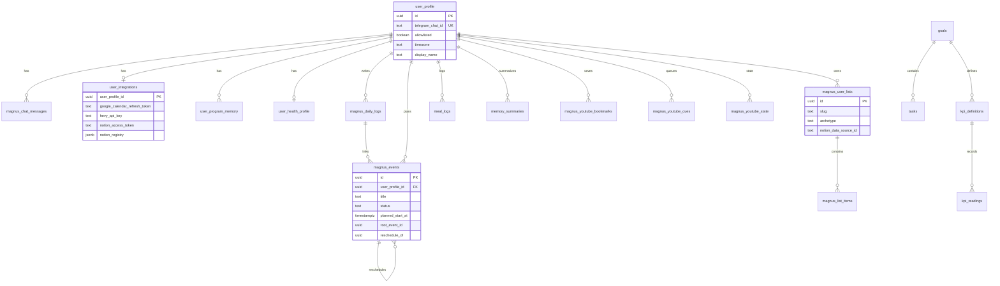

# Magnus — Database Schema & Storage

**Purpose:** Canonical reference for all Postgres tables, views, storage, and access patterns.  
**Project:** Supabase `xdrpjfdhduskhzryevze` (ap-northeast-1)  
**Last updated:** 2026-08-04

---

## 1. Identity model

```
Telegram user id (string)
    → user_profile.telegram_chat_id (unique)
    → user_profile.id (UUID, canonical FK for all domain tables)
```

All user-owned rows include `user_profile_id UUID NOT NULL REFERENCES user_profile(id) ON DELETE CASCADE`.

---

## 2. Access & security

| Pattern | Detail |
|---------|--------|
| **RLS** | Every table: `service_role_only` policy — `auth.role() = 'service_role'` |
| **App client** | `@supabase/supabase-js` with `SUPABASE_SERVICE_ROLE_KEY` only |
| **Anon key** | Blocked in production; RLS denies on most tables |
| **Per-user isolation** | Application-layer only (queries filter by `user_profile_id`) |
| **Secrets** | OAuth refresh tokens, API keys stored as `TEXT` in `user_integrations` |

**Risk:** Service role compromise = full database access. No row-level user policies.

---

## 3. Schema reproducibility status

| Category | Tables | In `supabase/migrations/`? |
|----------|--------|---------------------------|
| **Migrated (repo)** | `magnus_daily_logs`, `user_health_profile`, `meal_logs`, `memory_summaries`, `magnus_events`, `magnus_youtube_*`, `user_program_memory`, `user_integrations`, `magnus_user_lists`, `magnus_list_items` | Yes |
| **Hosted only** | `user_profile`, `magnus_chat_messages`, LifeOS domain tables (see §5) | **No** — applied directly to hosted project |
| **Reference SQL** | Hardening script | `scripts/magnus_db_hardening.sql` (not a migration) |

**Action required:** Baseline migration for hosted-only tables (see cleanup plan in `docs/review/IMPARTIAL_REVIEW_2026-08-04.md`).

---

## 4. Tables written by the application

### 4.1 `user_profile`

Core identity and access. **Hosted only — no migration in repo.**

| Column (known) | Type | Notes |
|----------------|------|-------|
| `id` | UUID PK | Canonical user id |
| `telegram_chat_id` | TEXT UNIQUE | Telegram `from.id` |
| `allowlisted` | BOOLEAN | Access gate |
| `timezone` | TEXT | IANA, e.g. `Asia/Kolkata` |
| `north_star_goal` | TEXT | Injected into memory block |
| `display_name` | TEXT | Added in `20260802120000_user_personalization.sql` |
| `user_tier` | TEXT | `standard` \| `premium` \| `internal` |
| `access_flags` | JSONB | e.g. `{ "chat": true }` |
| `created_at`, `updated_at` | TIMESTAMPTZ | |

### 4.2 `magnus_chat_messages`

Full conversation history. **Hosted only.**

| Column (known) | Type | Notes |
|----------------|------|-------|
| `id` | UUID PK | |
| `user_profile_id` | UUID FK | |
| `role` | TEXT | `user` \| `assistant` |
| `content` | TEXT | Message body |
| `metadata` | JSONB | `delegated_agent`, `intent`, `proactive`, routing |
| `message_type` | TEXT | `conversation` \| `automated` (migration `20260802180000`) |
| `delivery_trigger` | TEXT | `manual`, `scheduled`, `event_reminder`, … |
| `created_at` | TIMESTAMPTZ | |

### 4.3 `magnus_daily_logs`

Journal notes. Migration: `20260412120000_magnus_daily_logs.sql`.

| Column | Notes |
|--------|-------|
| `log_date`, `content`, `pillar`, `metadata` | Health journal uses `metadata.kind = 'health_journal'` |
| `notion_page_id` | Optional mirror |

### 4.4 `magnus_events`

Event log (commitments). Migration: `20260731120000_magnus_events.sql` (~580 lines).

**Design invariants:**
- Reschedule never edits time in place — closes old row, inserts linked successor
- `root_event_id` chains all versions; `reschedule_count` increments
- `activity_key` for adherence across differently-worded titles
- `remind_at` / `reminded_at` for proactive reminders
- `google_event_id` for calendar sync
- Generated columns: `planned_date`, `planned_minute_of_day`, `start_delay_minutes`
- View: `magnus_events_open` (active commitments)
- View: `magnus_event_activity_stats` (per-activity adherence)

**Status values:** `planned`, `in_progress`, `done`, `partial`, `skipped`, `missed`, `postponed`, `preponed`, `rescheduled`, `cancelled`

**Pillar values:** `health`, `wealth`, `wisdom`, `joy`, `magnus`

### 4.5 `meal_logs`

Meal logging with macro estimates. Migrations: `20260412180000` through `20260412220000`.

| Column | Notes |
|--------|-------|
| `meal_session_id` | Groups items in one sitting |
| `food_name`, `quantity`, `unit` | Parsed from user text |
| `calories`, `protein_g`, `carbs_g`, `fat_g` | Estimated |
| `estimate_source` | `web_research`, `usda`, `calorieninjas`, `llm`, … |
| `logged_at` | TIMESTAMPTZ |

### 4.6 `user_health_profile`

Health onboarding. Migration: `20260412140000_user_health_profile.sql`.

Four-question gate; `onboarding_completed_at` unlocks full health coaching.

### 4.7 `user_program_memory`

Per-user program sections. Migration: `20260802120000_user_personalization.sql`.

| Section | Purpose |
|---------|---------|
| `user_context` | Background, constraints |
| `weekly_schedule` | Mon-first gym/program table |
| `program_learnings` | Coaching notes |
| `recovery_routine` | Recovery protocol |

PK: `(user_profile_id, section)`.

### 4.8 `user_integrations`

Per-user OAuth and API credentials. Extended across migrations:

| Column | Added |
|--------|-------|
| `google_calendar_refresh_token` | `20260802120000` |
| `google_youtube_refresh_token` | `20260802150000` |
| `notion_access_token`, `notion_workspace_id`, `notion_registry` | `20260802140000`, `20260803180000` |
| `kite_access_token`, `kite_user_id`, `kite_api_key`, `kite_api_secret` | `20260803120000`, `20260803130000` |
| `hevy_api_key` | `20260802120000` |

### 4.9 `memory_summaries`

Rolling conversation summary + semantic facts. Migration: `20260729100000_memory_summaries.sql`.

| Column | Notes |
|--------|-------|
| `period` | `conversation_rolling` \| `semantic_facts` |
| `content` | TEXT summary or JSON facts |
| `metadata` | Turn range, extraction version |

Append-only by period; latest row wins on read.

### 4.10 `magnus_youtube_*`

Migration: `20260802120000_magnus_youtube.sql` + `20260803160000` (playlist aliases).

| Table | Purpose |
|-------|---------|
| `magnus_youtube_bookmarks` | Saved videos per user |
| `magnus_youtube_cues` | Play-next queue |
| `magnus_youtube_state` | Playlist aliases JSONB, last action |

### 4.11 `magnus_user_lists` / `magnus_list_items`

Migration: `20260803190000_magnus_user_lists.sql`.

**Lists:** slug, archetype (`media_queue`, `reading_queue`, …), optional Notion mirror ids.  
**Items:** title, status, notes, url, author, priority, `extra` JSONB, `notion_page_id`.

Supabase is **canonical**; Notion is optional mirror.

---

## 5. LifeOS tables (read-only in app today)

These exist on the hosted project (see `scripts/magnus_db_hardening.sql`). The app **reads** many of them for memory and Morning Brief but **writes none**.

| Table | Purpose (LifeOS) | Read by |
|-------|------------------|---------|
| `goals` | North star → weekly goal hierarchy | `memoryAgent`, `morningBriefContext` |
| `tasks` | Action items linked to goals | (schema exists; limited reads) |
| `kpi_definitions`, `kpi_readings` | Pillar KPIs | memory, brief |
| `pillar_status` | Per-pillar health signal | memory, brief |
| `happiness_reserve` | Joy tank level | memory, brief |
| `happiness_activities`, `activity_logs` | Joy activities | schema only |
| `patterns`, `life_patterns` | Detected patterns | memory, brief |
| `daily_scores` | Daily pillar scores | memory |
| `daily_plans` | Locked day plan | brief |
| `magnus_insights` | Generated insights | brief |
| `deviations`, `interventions` | Deviation tracking | schema only |
| `workouts` | Gym session history | `fitnessAgent` (read), Hevy is primary write path |
| `contacts`, `occasions`, `relationship_logs` | Relationships | schema only |
| `projects`, `features` | Bounded projects + milestones | **Written** — `src/projects/`; themes: custom, job_search, trip_plan, transformation, skill_sprint, event_plan |
| `project_sessions` | Multi-turn project setup FSM | **Written** — mirrors meal_plan_sessions |
| `learning_goals`, `learning_logs`, `learning_digest` | Learning | schema only |
| `budget_categories`, `meal_plans`, `energy_logs` | Domain logs | schema only |
| `weekly_reviews`, `watchlist` | Reviews, media | schema only |
| `magnus_mode` | Operating mode | schema only |
| `agent_computations`, `computation_dependencies` | Computation registry | schema only |

**This is the largest architectural gap:** schema promises a full LifeOS OS; runtime implements a subset.

---

## 6. Entity-relationship diagram (active tables)



---

## 7. Redis storage (Upstash)

Not Postgres, but part of durable/fast state:

| Key pattern | TTL | Purpose |
|-------------|-----|---------|
| `magnus:ratelimit:telegram:{id}` | 60s | Message rate limit bucket |
| `magnus:dedupe:update:{update_id}` | 24h | Webhook retry dedupe |
| `magnus:oauth:state:{provider}:{state}` | 15m | OAuth CSRF state |
| `magnus:proactive:morning-brief:{user}:{date}` | ~48h | Morning brief dedupe |
| `magnus:proactive:event-reminder:{event_id}` | varies | Reminder dedupe |

---

## 8. External storage (not in Supabase)

| Store | Content |
|-------|---------|
| **Notion** | Journal pages, Morning Brief pages, list mirrors, Magnus hub |
| **Google Calendar** | Events (linked via `magnus_events.google_event_id`) |
| **YouTube** | Playlists, watch history (via API; bookmarks/cues in Supabase) |
| **Hevy** | Workout sessions (read via API; `workouts` table is secondary) |
| **Zerodha Kite** | Portfolio (read via API; no local holdings table) |

---

## 9. Migration index

| File | Creates / alters |
|------|------------------|
| `20260401000000_baseline_user_profile.sql` | `user_profile` (baseline) |
| `20260401010000_baseline_magnus_chat_messages.sql` | `magnus_chat_messages` (baseline) |
| `20260412120000_magnus_daily_logs.sql` | `magnus_daily_logs` |
| `20260412140000_user_health_profile.sql` | `user_health_profile` |
| `20260412180000_meal_logs.sql` | `meal_logs` |
| `20260412190000_meal_logs_align_magnus.sql` | meal_logs align |
| `20260412210000_meal_session_and_daily_targets.sql` | meal session |
| `20260412220000_meal_logs_estimate_source_web_research.sql` | estimate source |
| `20260729100000_memory_summaries.sql` | `memory_summaries` |
| `20260731120000_magnus_events.sql` | `magnus_events` + views + triggers |
| `20260802120000_magnus_youtube.sql` | youtube tables |
| `20260802120000_user_personalization.sql` | display_name, program_memory, integrations |
| `20260802140000_user_integrations_notion.sql` | notion columns |
| `20260802150000_user_integrations_youtube.sql` | youtube token column |
| `20260802180000_magnus_chat_messages_type.sql` | message_type, delivery_trigger |
| `20260803120000_user_integrations_kite.sql` | kite tokens |
| `20260803130000_user_integrations_kite_app_creds.sql` | per-user kite app creds |
| `20260803160000_magnus_youtube_playlist_aliases.sql` | playlist_aliases |
| `20260803180000_user_integrations_notion_registry.sql` | notion_registry JSONB |
| `20260803190000_magnus_user_lists.sql` | lists + items |
| `20260804120000_baseline_lifeos_core.sql` | LifeOS core tables |
| `20260806160000_magnus_proactive_subscriptions.sql` | proactive subscriptions |
| `20260809140000_nutrition_local_date_rollups.sql` | nutrition rollups |
| `20260809160000_meal_plan_entries.sql` | meal plan entries |
| `20260809180000_meal_plan_sessions.sql` | meal plan sessions |
| `20260809190000_meal_plan_templates.sql` | meal plan templates |
| `20260810160000_projects_and_sessions.sql` | projects + project_sessions |
| `20260905170000_supabase_security_hardening.sql` | LifeOS views `security_invoker`; chat purge RPC locked to `service_role` |

---

## 10. Apply migrations

```bash
# Direct Postgres (production)
npm run db:apply -- supabase/migrations/<file>.sql

# Local Supabase CLI (when stack running)
supabase db push
```
