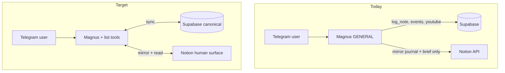

# Notion × Magnus × LifeOS — structure reference

**Purpose:** Single reference for what exists today, what Magnus can actually do with Notion, and the target layout for lists, logs, and trackers. Update this when Notion databases or `user_integrations` ids change.

**Related:** `magnus.md`, `MAGNUS_CORE_CONTEXT.md`, `docs/ARCHITECTURE.md`

**Last updated:** 2026-08-03

---

## 1. Roles (do not conflate)

| Layer | Role |
|-------|------|
| **Notion** | Human-readable surface — browse, edit, share, manual capture |
| **Supabase** | Machine source of truth — Magnus tools, memory, Morning Brief, proactive nudges |
| **`user_integrations`** | Per-user Notion token + database/page UUID registry |

**Rule:** Magnus writes Supabase first; Notion mirror is best-effort (see `logNoteTool.ts`). Losing Notion must never lose the note.

---

## 2. Current state (as of 2026-08-03)

### 2.1 Notion connection (configured in Supabase)

| Field | Value (configured) | Used at runtime? |
|-------|-------------------|------------------|
| `notion_token` | Yes | Yes — API auth |
| `notion_daily_log_parent_page_id` | LifeOS hub (`32cb455a-f233-811b-9e29-fcd84f710759`) | Yes — `log_note` mirror |
| `notion_morning_brief_parent_page_id` | Same LifeOS hub | Yes — Morning Brief subpage |
| `notion_goals_database_id` | `29414966-cd2f-4f56-9933-ccf0010933d8` | **No** — id stored, no tool calls it |
| `notion_daily_checkins_database_id` | `418daa9b-ff95-4947-925a-e53d9b3a59c6` | **No** — id stored, no tool calls it |

**Not wired in code or integrations:** watchlist, readlist, music list, travel list, patterns log, tasks DB, contacts DB, experiences DB.

### 2.2 What Magnus can do with Notion today

| Action | How | Status |
|--------|-----|--------|
| Append journal line to dated page | Magnus `log_note` tool → `magnus_daily_logs` + Notion child page `Magnus Log — YYYY-MM-DD` | **Working** |
| Create Morning Brief page | Cron/manual brief → child page under morning-brief parent | **Working** (when parent configured) |
| Query daily check-in | `queryDatabaseByDateProperty()` in `notion.ts` | **Library only** — no agent/tool |
| Create goal row | `createGoalPage()` in `notion.ts` | **Library only** — no agent/tool |
| Full list CRUD (watch/read/music/travel/todo) | — | **Not built** |
| Read Notion for recommendations | — | **Not built** |
| Nudge from Notion due dates | — | **Not built** |

The old **`notionAgent`** and **`NOTION` intent** described in older docs (`docs/AGENT_ROSTER.md`, `docs/EXISTING_TO_PILLAR_MAP.md`) are **removed**. Notion is no longer a routing destination — only Magnus's `log_note` and Morning Brief touch Notion.

### 2.3 Supabase list/log tables (Magnus-side)

Most LifeOS tables exist in Supabase but **nothing in the bot writes to them** (0 rows). Memory and Morning Brief **read** them and report `gaps`.

| Your list | Supabase table | Rows | Written by Magnus? | Notes |
|-----------|----------------|------|-------------------|-------|
| **Todo / open loops** | `tasks` | 0 | No | status, due_date, pillar, goal_id |
| **Goals** | `goals` | 0 | No | Also has Notion Goals DB id (unused) |
| **Watchlist (film/TV)** | `happiness_activities` (`category`) | 0 | No | Schema fits joy/media; default status `unwatched` |
| **Readlist (books)** | `happiness_activities` | 0 | No | Same table, different `category` |
| **Music list** | `magnus_youtube_bookmarks` | 3 | Yes (YouTube tools) | Supabase only — no Notion mirror |
| **Travel list** | — | — | No | No dedicated table; could use `happiness_activities` or new `travel_plans` |
| **Happiness events / experiences** | `happiness_activities` + `activity_logs` | 0 | No | `activity_logs` tracks suggest/complete/mood |
| **Happiness meta-metric** | `happiness_reserve`, `mood_logs`, `emotional_events` | 0 | No | Joy tank model |
| **Stock watchlist** | `watchlist` | 0 | No | **Wealth/trading** — NSE symbols, not film |
| **Daily free-form log** | `magnus_daily_logs` | 0 | Yes (`log_note`) | Mirrors to Notion when configured |
| **Commitments / calendar** | `magnus_events` | 9 | Yes (event log tools) | Not a "list" but primary day structure |
| **Patterns** | `patterns`, `life_patterns` | — | No | **Tables referenced in code but do not exist in DB** |
| **Contacts / relationships** | `contacts`, `relationship_logs`, `occasions` | 0 | No | Social CRM schema ready |
| **Learning** | `learning_goals`, `learning_logs` | 0 | No | Wisdom pillar |

### 2.4 Notion workspace (external — manual inventory)

Known pages from product docs (content lives in Notion, not this repo):

| Page | URL |
|------|-----|
| LifeOS hub | https://www.notion.so/32cb455af233811b9e29fcd84f710759 |
| LifeOS — Build Master | https://www.notion.so/32eb455af23381519d6be61a92eded4f |
| MAGNUS — Master Architecture & Plan | https://www.notion.so/33fb455af23381c8bc1edc33e1775782 |
| Agent Architecture | https://www.notion.so/32eb455af233816aad7eeaa50baf5b00 |

Run `npx tsx scripts/audit-notion-lifeos.mts` locally (with `NOTION_TOKEN` in `.env`) to print child databases under the hub and compare to `user_integrations`.

---

## 3. Gap summary



| Capability you asked for | Today |
|--------------------------|-------|
| Read lists | Partial — YouTube bookmarks, event log; not Notion lists |
| Write / create / edit lists | Event log + journal + YouTube only |
| Maintain / pick / share | No list picker; no Notion share flow |
| Recommend from lists | Happiness agent is prompt-only, no list data |
| Log and monitor | `magnus_events`, meal_logs, chat — not joy lists |
| Review and share feedback | Morning Brief reads empty LifeOS tables |
| Nudge and notify | Event reminders only — not list-based |

---

## 4. Ideal structure

### 4.1 Design principles

1. **One canonical row per item in Supabase** — Magnus always reads/writes here.
2. **Notion mirrors with `notion_page_id`** on the row (same pattern as `magnus_daily_logs.notion_page_id`).
3. **Unified joy/media registry** — prefer one table + `list_type` over seven duplicate schemas.
4. **Registry in `user_integrations`** — JSON map or explicit columns for each Notion database id.
5. **Notion stays cross-cutting** — not owned by Wisdom/Happiness routing; Magnus tools handle sync.
6. **Views, not duplicates** — in Notion, use filtered views (Watchlist, Readlist, …) on one database.

### 4.2 Target Notion hub layout

```
LifeOS Hub
├── 📓 Rituals (pages)
│   ├── Magnus Log/          ← notion_daily_log_parent_page_id ✓
│   ├── Morning Brief/       ← notion_morning_brief_parent_page_id ✓
│   └── Reviews/             (weekly, quarterly — future)
│
├── 🎯 Planning
│   ├── Goals                  ← notion_goals_database_id ✓ (wire tools)
│   ├── Tasks & Open Loops     ← new: notion_tasks_database_id
│   └── Daily Check-ins        ← notion_daily_checkins_database_id ✓ (wire tools)
│
├── 💛 Joy & Media (one DB, many views)
│   └── Media & Experiences    ← new: notion_media_database_id
│       Views: Watchlist | Readlist | Music | Travel | Experiences
│
├── 👥 People
│   └── Contacts & Occasions   ← optional Notion mirror of contacts
│
└── 🧠 Intelligence
    └── Patterns Log           ← new: notion_patterns_database_id (+ create Supabase patterns table)
```

### 4.3 Target Supabase mapping

| List / log | Canonical table | Key fields | Notion sync |
|------------|-----------------|------------|-------------|
| Todo | `tasks` | title, status, due_date, pillar, priority | Mirror row; bidirectional optional later |
| Goals | `goals` | pillar, timeframe, status, title | Already has DB id — implement sync |
| Watchlist | `happiness_activities` | category=`watch`, title, url, status, notes | `notion_page_id` column (add) |
| Readlist | `happiness_activities` | category=`read`, … | same DB |
| Music | `magnus_youtube_bookmarks` | video_id, kind, title, url | optional view in Media DB or keep Supabase-only |
| Travel | `happiness_activities` or `travel_plans` (new) | category=`travel`, dates, place | Media DB view |
| Experiences / happiness events | `activity_logs` + `happiness_activities` | completed, mood, reserve_impact | Media DB + event log link |
| Daily journal | `magnus_daily_logs` | body, log_date | ✓ already mirrored |
| Patterns | `patterns` (create table) | strength, pillars, description | Patterns Log DB |

**Recommended `happiness_activities.category` values:** `watch`, `read`, `music`, `game`, `travel`, `experience`, `rest`, `social`.

**Recommended `happiness_activities.status` values:** `queued`, `in_progress`, `done`, `dropped` (replace legacy `unwatched` over time).

### 4.4 Target Magnus tools (implementation phases)

| Phase | Tools | User-facing |
|-------|-------|-------------|
| **A — Registry** | Extend `user_integrations` with `notion_registry JSONB`; audit script | Ops only |
| **B — Read** | `list_media`, `list_tasks`, `get_checkin` | "what's on my watchlist?", "today's check-in" |
| **C — Write** | `add_media`, `update_media`, `add_task`, `complete_task`, `log_experience` | "add Dune to watchlist", "finished Project Hail Mary" |
| **D — Sync** | Notion ↔ Supabase upsert on write; nightly reconcile job | Edits in Notion appear in Telegram |
| **E — Proactive** | Stale-list nudges, joy tank + suggest from `suggestable_activities` view | "You queued 3 films — pick one?" |

### 4.5 `user_integrations` target shape

```typescript
// Option A: explicit columns (simple, matches today)
notion_tasks_database_id
notion_media_database_id
notion_patterns_database_id
notion_contacts_database_id

// Option B: single JSON registry (scales better)
notion_registry: {
  goals: "29414966-...",
  daily_checkins: "418daa9b-...",
  media: "<uuid>",
  tasks: "<uuid>",
  patterns: "<uuid>",
  property_map: {
    media: { title: "Name", list_type: "List", status: "Status", url: "URL" }
  }
}
```

---

## 5. Streamlining recommendations

### Immediate (no new Notion DBs)

1. Run `scripts/audit-notion-lifeos.mts` and paste output into this doc's §2.4 table.
2. Wire existing helpers: `createGoalPage`, `queryDatabaseByDateProperty` into Magnus tools (Goals + check-ins already have ids).
3. Start writing `happiness_activities` from Happiness/GENERAL turns before building Notion sync.

### Short term (one new Notion DB)

4. Create **Media & Experiences** database under LifeOS hub with views; store id in `user_integrations`.
5. Add `notion_page_id` to `happiness_activities` and `tasks` migrations.
6. Implement `add_media` / `list_media` tools (Supabase first, Notion mirror second).

### Medium term

7. Create missing `patterns` table in Supabase; sync to Notion Patterns Log.
8. Bidirectional sync job (Notion webhook or poll) for manual edits.
9. Deprecate stale docs referencing `notionAgent` / `NOTION` intent.

---

## 6. Scripts

| Command | Purpose |
|---------|---------|
| `npx tsx scripts/audit-notion-lifeos.mts` | Inventory Notion pages/DBs under configured parent |
| `TELEGRAM_USER_ID=… npx tsx scripts/upsert-user-integrations.mts` | Push Notion ids from `.env` to Supabase |

---

## 7. Cursor / IDE Notion access

Notion MCP skills in Cursor are **IDE-only** (agent session with your Notion OAuth). They do not run inside the Telegram bot. Server-side Magnus uses `@notionhq/client` via per-user `notion_token` in Supabase.

For Cloud Agents without Notion MCP: use the audit script locally or paste database ids into `user_integrations`.
