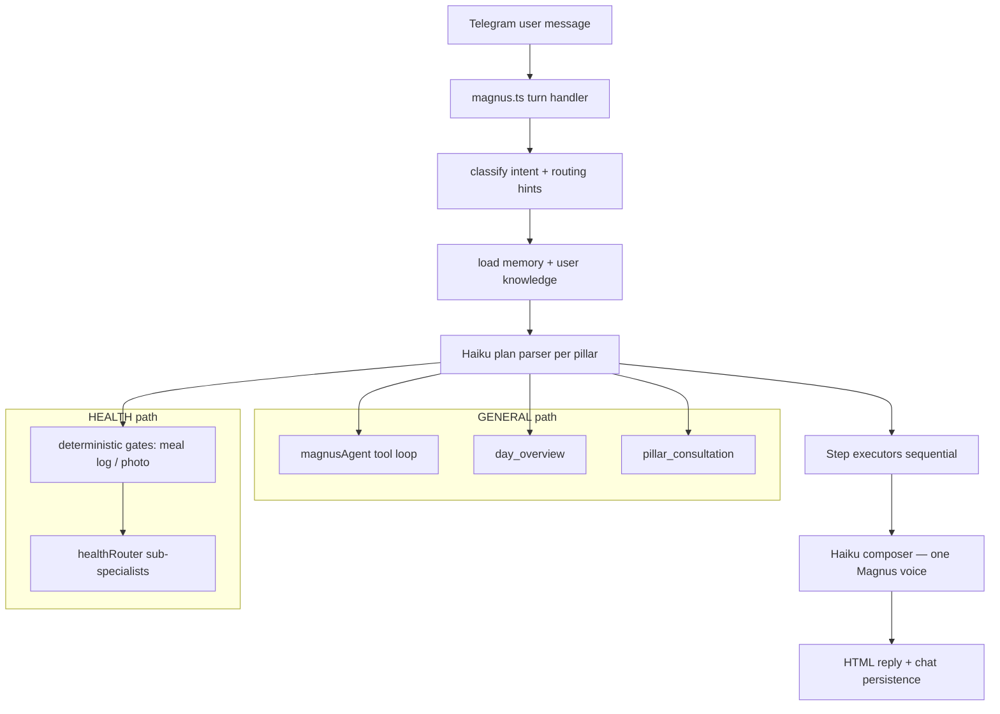

# Magnus — tools, agents, and proactive jobs

**Purpose:** Single diagram of everything built in this repo: who runs, what they can do, and why they exist.  
**Companion:** `docs/USER_QUERY_GUIDE.md`, `magnus.md`, `docs/diagrams/ARCHITECTURE_DIAGRAMS.md`  
**Last updated:** 2026-08-09

---

## 1. One voice, five intents

The user always talks to **Magnus**. Each turn is classified silently into one of five intents. Specialists may answer, but the user never addresses them directly.

| Intent | Owner | Depth | Purpose |
|--------|-------|-------|---------|
| `GENERAL` | Magnus (`magnusAgent.ts`) | **Tools** — only agent with tools | Day/week, calendar, lists, LifeOS, Notion, YouTube, event log, reminders, cross-pillar orchestration |
| `HEALTH` | Health composite (`healthRouter.ts`) | **Deep** — sub-router + executors | Training, meals, sleep, recovery, health journal, Hevy, meal planning journey |
| `WEALTH` | Wealth (`wealthAgent.ts` + Kite read) | Shallow + Kite context | Money coaching, portfolio read via Zerodha |
| `HAPPINESS` | Happiness (`happinessAgent.ts`) | Shallow prompt | Leisure, taste, travel, relationships, creative joy |
| `WISDOM` | Wisdom (`wisdomAgent.ts`) | Shallow prompt | Learning plans, career, shipping projects |

Classifier: `orchestratorIntent.ts` · Registry: `registry.ts` · Plan parser: `pillarStrategy/`

---

## 2. Request flow (cohesive architecture)

**Principles enforced in code:**

1. **Input parse → execute → output parse (compose)** — terminal Magnus voice at every exit (`finalizeMagnusVoice.ts`).
2. **Only Magnus has tools** — pillar specialists are prompt-only (Health/Wealth add data in executors).
3. **Structural hints, not regex overrides** — `intentRoutingHints.ts`; hard override only for explicit meal-log format.
4. **Action integrity** — `actionIntegrity.ts` blocks false save/add claims unless tools succeeded.

---

## 3. Magnus tools (`magnusAgent.ts`)

| Tool | Capability bucket | What it does |
|------|-------------------|--------------|
| `read_calendar` | calendar | Read Google Calendar range |
| `create_calendar_event` | calendar | Create event |
| `update_calendar_event` | calendar | Update by event id from prior read |
| `delete_calendar_event` | calendar | Delete by event id |
| `connect_google` / `connect_calendar` / `connect_youtube` | calendar, youtube | Unified Google OAuth link |
| `log_event` | event_log | Plan commitment in `magnus_events` |
| `update_event` | event_log | Mark done/skipped |
| `reschedule_event` | event_log | Chain reschedule (never edit time in place) |
| `list_events` | event_log | List commitments |
| `youtube_search` | youtube | Search YouTube / YT Music |
| `youtube_recommend` | youtube | Recommend from query |
| `youtube_playlist` | youtube | Playlist add/remove/clear/dedupe |
| `youtube_bookmark` | youtube | Save bookmark |
| `youtube_cue` | youtube | Queue cue |
| `list_catalog` | lists | Show list slugs |
| `list_items` | lists | Read items from a list |
| `add_list_item` / `update_list_item` | lists | Write list rows (Supabase canonical) |
| `create_list` / `link_notion_list` | lists | New list or Notion link |
| `recommend_list_items` | lists | Filter recommend from saved list |
| `list_notion_items` / `add_notion_item` / `update_notion_item` | lists | Direct Notion list ops |
| `add_goal` / `add_notion_goal` | lists, lifeos | Goals dual-write |
| `update_pillar_status` | lifeos | Pillar on_track / at_risk |
| `log_joy_tank` | lifeos | Joy tank level |
| `list_lifeos_goals` | lifeos | Read goals table |
| `get_daily_checkin` / `log_daily_checkin` | lifeos | Daily check-in read/write |
| `connect_notion` / `sync_notion` / `setup_notion` | notion | Notion OAuth and provision |
| `connect_zerodha` / `connect_kite` | zerodha_connect | Kite OAuth link |
| `manage_proactive_messages` | proactive | Enable/disable/create reminders |
| `log_note` | journal_note | Quick note → `magnus_daily_logs` |

Capability → tool filter: `generalCatalog.ts` (`GENERAL_CAPABILITY_TOOLS`).

---

## 4. Health sub-agents (`healthRouter.ts`)

| Capability id | Agent / module | Purpose |
|---------------|----------------|---------|
| `meal_log` | `mealLogPipeline` + gates | Explicit `meal:` / `/meal` format |
| `meal_log_photo` | Vision + meal pipeline | Telegram photo attachment |
| `meal_log_correct` | Meal correction flow | Fix last log |
| `meal_history` / `meal_breakdown` / undo | `mealHistoryAgent` | Past logs and detail |
| `meal_targets_*` | `mealTargetAgent` | Show/set macro targets |
| `meal_plan_*` | `mealPlanningAgent`, templates, shopping | Multi-turn plan journey |
| `journal` | `healthJournalAgent` | EOD health journal |
| `hevy_write` | `hevyWriteAgent` | `hevy routine:` / `hevy workout:` |
| `fitness` | `fitnessAgent` + Hevy context | Training coaching |
| `alternates` | `alternatesRecommenderAgent` | Food swaps |
| `nutrition_advice` | `nutritionAgent` | Q&A without logging |
| `energy` | `energyAgent` | Sleep, fatigue, recovery |
| `long_term_planning` | `longTermHealthPlanningAgent` | Season / race arcs |
| `generic_ack` | Fallback | Unmatched health phrasing |

Onboarding gate: `healthOnboarding.ts` (four questions until `user_health_profile` complete). Meal log bypasses gate.

---

## 5. Shallow pillar agents

| Pillar | File | Capabilities (plan parser) |
|--------|------|---------------------------|
| Wealth | `wealthAgent.ts` | `kite_connect`, `coaching` (+ Kite portfolio context in executor) |
| Happiness | `happinessAgent.ts` | `recommendations`, `travel_rest`, `relationships`, `creative_practice`, `coaching` |
| Wisdom | `wisdomAgent.ts` | `learning_plan`, `career_direction`, `project_shipping`, `skill_practice`, `coaching` |

Runner: `pillarSpecialist.ts` — shared prompt-only path with anti-tool-claim guard.

---

## 6. Cross-cutting agents (not user-facing personas)

| Module | Purpose |
|--------|---------|
| `memory/memoryAgent.ts` | Load chat history, summaries, facts, goals; post-turn maintenance |
| `memory/userKnowledge.ts` | User graph: lists, integrations, patterns, playlists |
| `routing/finalizeMagnusVoice.ts` | Terminal voice when inner path skipped compose |
| `routing/agentConsultation.ts` | Multi-pillar `pillar_consultation` step |
| `routing/dayOverview.ts` | Calendar + events + planned meals snapshot |
| `jobs/morningBrief.ts` | Read-only morning brief (cron, `/morningbrief`, HTTP job) |

**Not in the bot runtime:** `mcp/google-calendar/server.mts` (stdio MCP for Cursor only).

---

## 7. Proactive outbound (Magnus-initiated Telegram)

Cron: `proactive/cron.ts` · Dispatcher: `proactive/dispatcher.ts` · Tool: `manage_proactive_messages`

| Kind | Trigger | Purpose |
|------|---------|---------|
| `morning_brief` | Local hour + timezone | Daily read (separate job in `morningBriefJob.ts`) |
| `event_reminder` | `remind_at` on events | Commitment reminders |
| `gym_hevy_reconcile` | After gym + grace window | Match Hevy session to event log |
| `nutrition_nightly` | ~23:00 local | Rollups, anomalies, program memory sync |
| `evening_journal` | Subscription / catalog | LLM-gated EOD journal nudge |
| `drift_guard` | Subscription | Drift from commitments |
| `midday_encouragement` | Subscription | Midday encouragement |
| `stale_list_nudge` | 14+ days idle list items | Joy/media backlog |
| `chat_inactivity` | 3+ days no messages | Re-engagement |
| `meal_log_reminder` | Meal schedule | Remind to log |
| `meal_adherence_nudge` | Plan vs log gap | Adherence |
| `meal_eod_reconciliation` | End of day | Meal reconciliation |
| `meal_gap_nudge` | Missing meal slot | Gap nudge |
| `weekly_nutrition_review` | Weekly | Nutrition review |
| `custom_reminder` | User-created | One-shot or daily custom |

---

## 8. External integrations

| Integration | Optional | Used by |
|-------------|----------|---------|
| Telegram | Required | Interface |
| Supabase | Required | All persistence |
| Upstash Redis | Required | Rate limit, dedupe, OAuth state |
| Anthropic Claude | Required | Classifier, agents, compose |
| Google Calendar + YouTube | Per-user OAuth | Magnus tools |
| Notion | Per-user OAuth | Lists mirror, journal, brief pages |
| Hevy | Per-user API key | Health fitness + reconcile job |
| Zerodha Kite | Per-user OAuth | Wealth portfolio read |
| USDA / CalorieNinjas / web search | Platform keys | Meal macro estimates |

---

## 9. Cursor workspace agents (development only)

These live under `.cursor/` and are **not** part of the Telegram bot runtime:

| Path | Purpose |
|------|---------|
| `.cursor/agents/health.md` | Cursor subagent routing for health pillar work |
| `.cursor/skills/health/*` | Skill templates and reference journals (owner content seeded to DB via provision script) |
| `.cursor/rules/magnus-md-maintenance.mdc` | Enforce `magnus.md` updates on behavior changes |

---

## 10. Maintenance

When adding a Magnus tool: update `magnusAgent.ts`, `generalCatalog.ts`, this file, and `src/capabilities/catalogIntegrity.test.ts`.

When adding a health capability: update `healthCatalog.ts`, executor in `executeHealthPlanStep.ts`, and `docs/USER_QUERY_GUIDE.md`.
