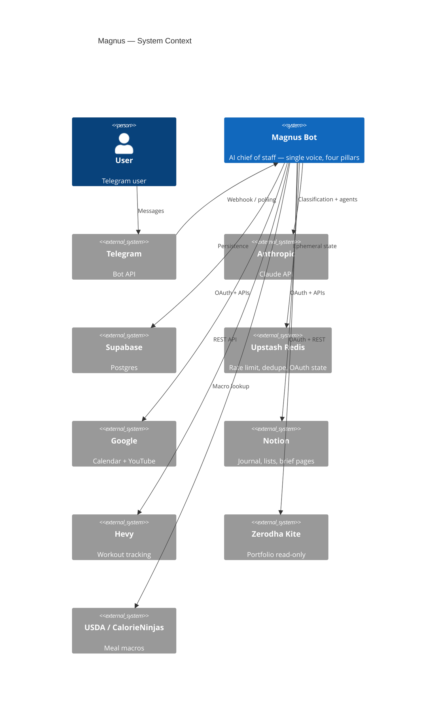
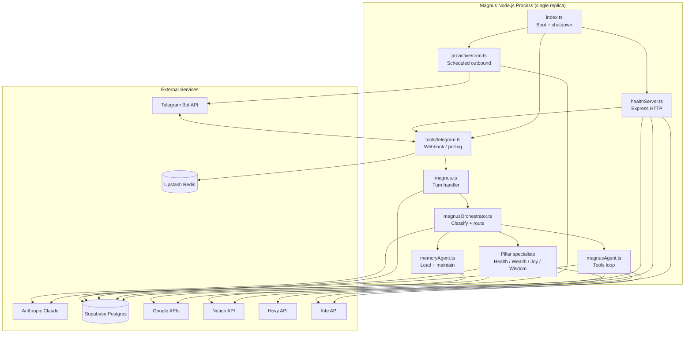
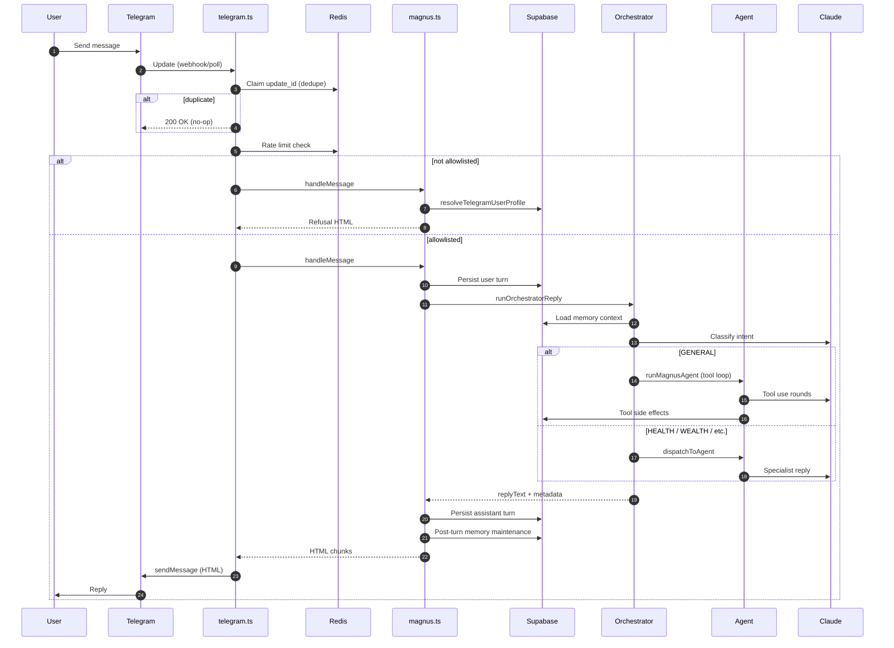
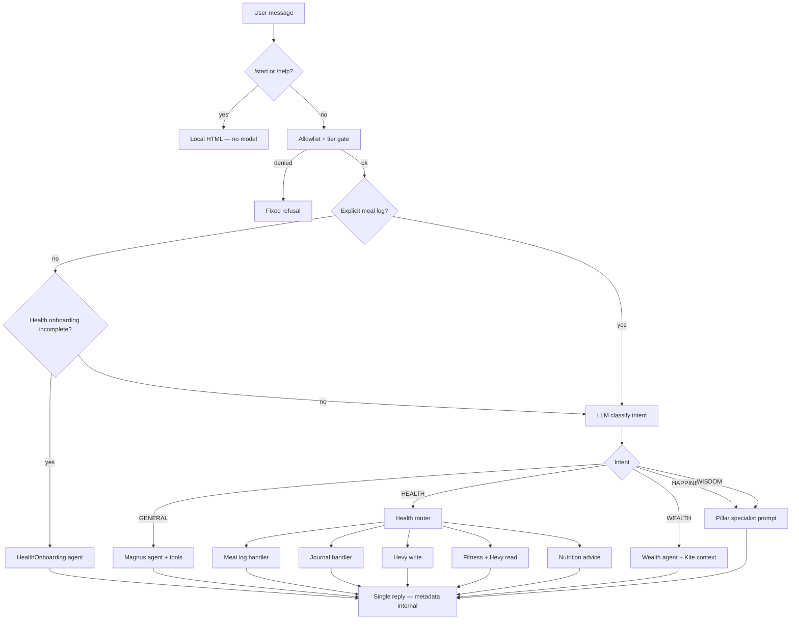
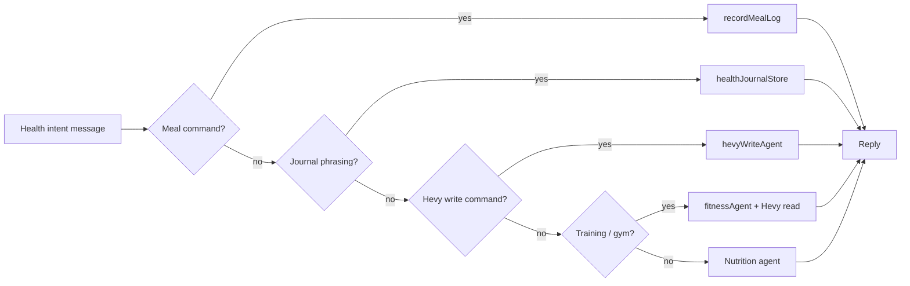
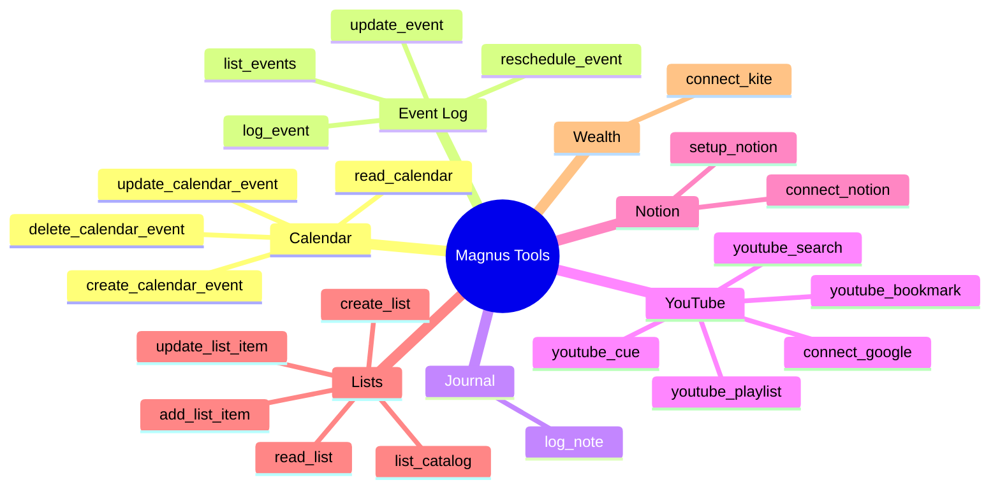
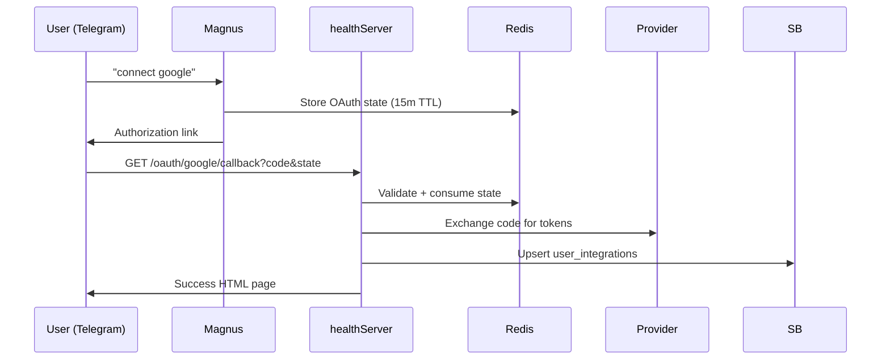
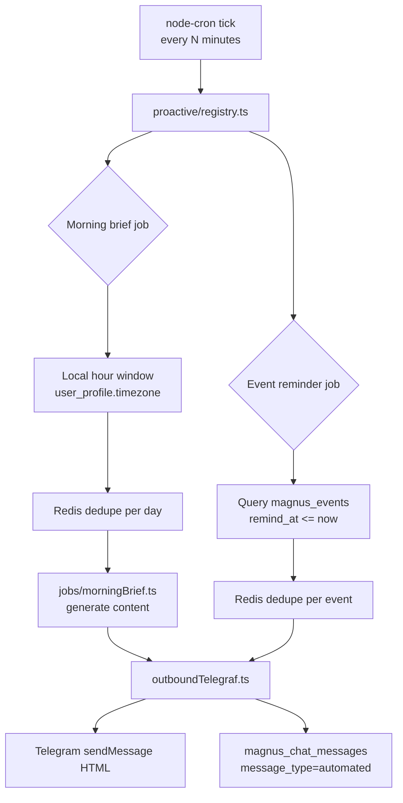
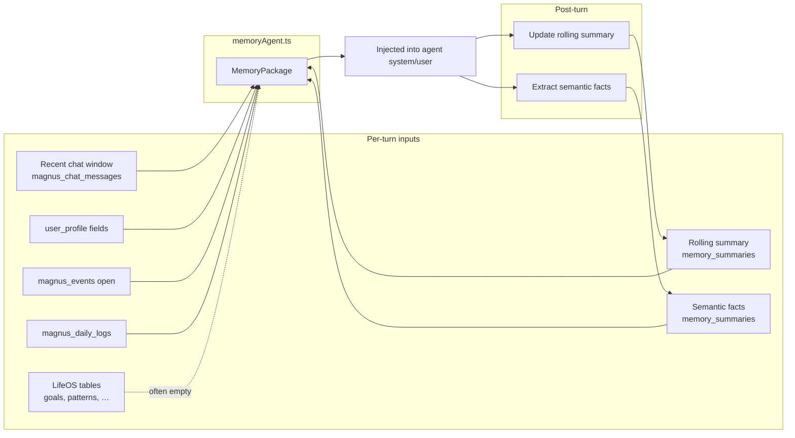
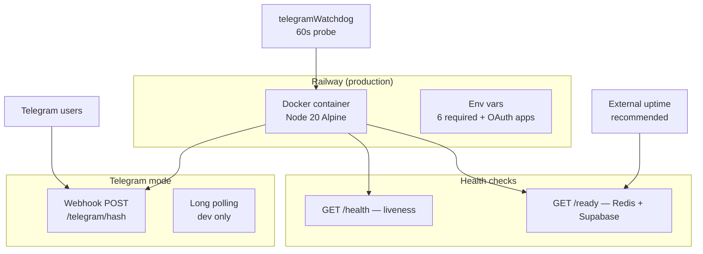

# Magnus — Architecture Diagrams

**Purpose:** Visual reference for system topology, request flow, data flow, and deployment.  
**Companion:** `docs/ARCHITECTURE.md`, `docs/DATABASE_SCHEMA.md`, `magnus.md`  
**Last updated:** 2026-08-04

---

## 1. System context (C4 Level 1)

---

## 2. Container diagram (C4 Level 2)

---

## 3. Request flow — user message

---

## 4. Agent routing decision tree

---

## 5. Health sub-router (first-accept)

---

## 6. Magnus tool surface

---

## 7. OAuth flows

**Providers:** Google (Calendar + YouTube unified), Notion, Zerodha Kite.

---

## 8. Proactive messaging

---

## 9. Memory architecture

---

## 10. Deployment topology

---

## 11. Five-layer target vs current

| Layer | Target (LifeOS vision) | Current implementation |
|-------|------------------------|------------------------|
| 5 — Interface | Telegram + future web | **Telegram only** |
| 4 — Orchestrator | Route, delegate, synthesize | **magnusOrchestrator.ts** ✓ |
| 3 — Agent layer | Deep pillar specialists | **Health deep; others shallow** |
| 2 — Tools | Per-domain APIs | **Magnus tools + Health APIs** |
| 1 — Memory | Postgres + pgvector + Redis | **Postgres + Redis; no vectors** |

---

## 12. Pillar / intent / DB mapping

| User-facing pillar | Intent enum | Event log `pillar` | Agent module |
|--------------------|-------------|-------------------|--------------|
| Magnus (cross-cutting) | `GENERAL` | `magnus` | `magnusAgent.ts` |
| Health | `HEALTH` | `health` | `healthRouter.ts` |
| Wealth | `WEALTH` | `wealth` | `wealthAgent.ts` |
| Happiness (Joy) | `HAPPINESS` | `joy` | `pillarSpecialist.ts` |
| Wisdom | `WISDOM` | `wisdom` | `pillarSpecialist.ts` |

**Note:** LifeOS philosophy uses "Joy"; code uses `HAPPINESS` intent. DB events use `joy`.
