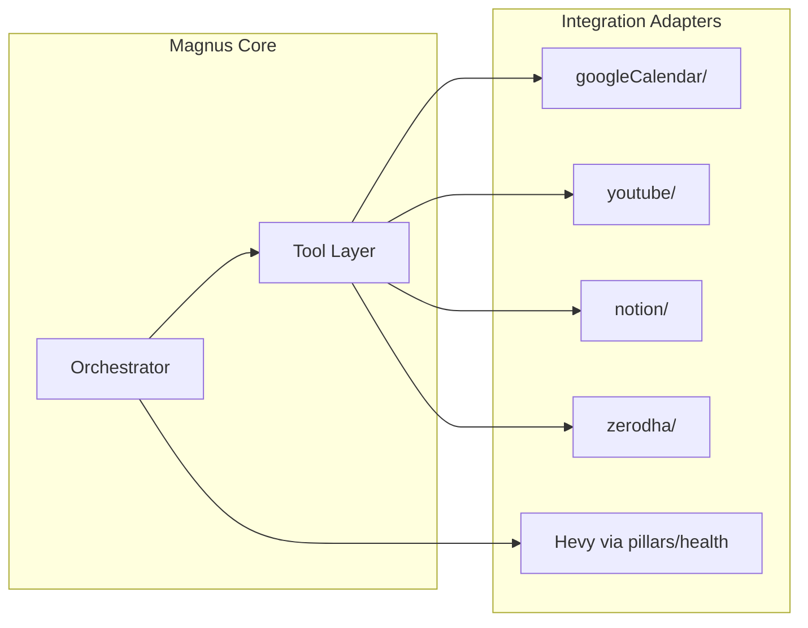

# Magnus — Architecture Requirements Document (ARD)

**Version:** 1.0  
**Last updated:** 2026-08-04  
**Status:** Active — records decisions and constraints  
**Companion:** `docs/product/TRD.md`, `docs/diagrams/ARCHITECTURE_DIAGRAMS.md`

---

## 1. Purpose

Documents **architectural decisions**, principles, constraints, and quality attributes for Magnus. Serves as the decision log for why the system is shaped as it is.

---

## 2. Architecture principles

| # | Principle | Implication |
|---|-----------|-------------|
| AP-1 | **One voice** | No specialist announcements; routing is metadata only |
| AP-2 | **Magnus owns tools** | Only `GENERAL` intent runs tool loop; pillars are prompt-first |
| AP-3 | **Earn depth per pillar** | Health is deep because usage justified it; don't pre-build Wealth tools |
| AP-4 | **Supabase is machine truth** | Notion is human mirror; conflict resolves to Supabase |
| AP-5 | **Immutable event history** | Reschedule chains, never in-place time edits |
| AP-6 | **Fail loud in dev, degrade in prod** | Log errors; user gets helpful message not stack trace |
| AP-7 | **Single replica simplicity** | No distributed locks except Redis; webhook not polling in prod |
| AP-8 | **Core vs personalised split** | Prompts in code; user data in DB |

---

## 3. Architectural style

**Pattern:** Modular monolith — single Node.js process with domain folders.

```
src/
├── agents/          # Orchestration + specialists + tools
├── integrations/    # Third-party API adapters
├── pillars/         # Deep domain (health workouts, wealth kite)
├── events/          # Event log domain
├── lists/           # List catalog domain
├── meals/           # Meal pipeline
├── proactive/       # Scheduled outbound
├── tools/           # Telegram, chat log, clients
└── config/          # Runtime configuration
```

**Not chosen:** Microservices, serverless per-agent, separate worker queue (yet).

---

## 4. Key architectural decisions (ADRs)

### ADR-001: Telegram as sole interface

| | |
|---|---|
| **Status** | Accepted |
| **Context** | LifeOS docs mention WhatsApp; owner uses Telegram |
| **Decision** | This repo implements Telegram only |
| **Consequences** | HTML formatting layer; 4096 char chunking; no rich UI components |

### ADR-002: Claude for classification and all agents

| | |
|---|---|
| **Status** | Accepted |
| **Context** | Could use smaller model for classification |
| **Decision** | `claude-sonnet-4-6` everywhere for consistency |
| **Consequences** | Higher cost; simpler ops; one model to tune |

### ADR-003: Service-role-only database access

| | |
|---|---|
| **Status** | Accepted (with known risk) |
| **Context** | Single backend; no client-side Supabase |
| **Decision** | RLS `service_role_only`; app enforces `user_profile_id` |
| **Consequences** | Simple; key compromise is catastrophic; no per-user DB policies |

### ADR-004: Redis for ephemeral state only

| | |
|---|---|
| **Status** | Accepted |
| **Context** | Need rate limit, dedupe, OAuth state, proactive dedupe |
| **Decision** | Upstash Redis REST; not session store for chat |
| **Consequences** | Chat history in Postgres; Redis outage affects guardrails not data |

### ADR-005: Magnus tools, not pillar tools

| | |
|---|---|
| **Status** | Accepted |
| **Context** | Calendar/YouTube span pillars; specialists shouldn't claim tool actions |
| **Decision** | YouTube/coerce to GENERAL; calendar owned by Magnus |
| **Consequences** | Intent coercion rules in `orchestratorIntent.ts` |

### ADR-006: Event log separate from calendar

| | |
|---|---|
| **Status** | Accepted |
| **Context** | Commitments != calendar events; need adherence tracking |
| **Decision** | `magnus_events` canonical; optional `google_event_id` link |
| **Consequences** | Rich domain model; sync logic on calendar mutate |

### ADR-007: Unified Google OAuth

| | |
|---|---|
| **Status** | Accepted |
| **Context** | Separate YouTube + Calendar consent was friction |
| **Decision** | One OAuth flow; dual-write refresh token to both columns |
| **Consequences** | Legacy `/oauth/youtube/*` aliases remain |

### ADR-008: Proactive in-process cron

| | |
|---|---|
| **Status** | Accepted |
| **Context** | Could use external scheduler (Railway cron, Supabase pg_cron) |
| **Decision** | `node-cron` in same process; registry pattern for jobs |
| **Consequences** | Simple; tied to replica uptime; job dedupe in Redis |

### ADR-009: Multi-user on single deployment

| | |
|---|---|
| **Status** | Accepted |
| **Context** | Started as single-user; provision scripts added multi-user |
| **Decision** | `user_profile` per Telegram id; per-user `user_integrations` |
| **Consequences** | Auto-allowlist risk; need explicit production policy |

### ADR-010: No vector memory (yet)

| | |
|---|---|
| **Status** | Deferred |
| **Context** | LifeOS vision includes pgvector |
| **Decision** | Rolling summary + semantic facts in `memory_summaries` first |
| **Consequences** | No embedding cost; recall limited to window + extracted facts |

---

## 5. Quality attributes

| Attribute | Target | Mechanism |
|-----------|--------|-----------|
| **Maintainability** | High | TypeScript, domain folders, import graph audit |
| **Testability** | Medium-high | Vitest unit tests; mock external APIs |
| **Scalability** | Low (by design) | Single user / small user count per deployment |
| **Availability** | Medium | Watchdog + Railway restart; no HA |
| **Security** | Medium | Service role; needs hardening (see TRD SEC-*) |
| **Portability** | Medium | Docker; depends on Supabase + Upstash + Anthropic |

---

## 6. Integration architecture



**Rule:** Integrations are thin adapters; domain logic lives in `events/`, `lists/`, `meals/`, `pillars/`.

---

## 7. Boundary definitions

| Boundary | Inside | Outside |
|----------|--------|---------|
| Magnus process | Turn handling, cron, OAuth callbacks | Telegram servers, Anthropic, Supabase hosted |
| Agent layer | Prompt + tool definitions | Model weights, training |
| Memory | Load/assemble package | Long-term LifeOS analytics jobs (not built) |
| Notion | Mirror writes | Notion's UI and permissions |
| MCP (`mcp/google-calendar/`) | Cursor IDE tool | **Not** production bot |

---

## 8. Constraints

1. **Telegram message size** — drives chunking, brief length limits
2. **Anthropic tool round cap** — prevents runaway loops
3. **Google API quotas** — calendar + YouTube share OAuth project
4. **Zerodha Kite** — read-only; MF writes return 403 on current app
5. **Single replica** — no horizontal scale without webhook + shared Redis redesign

---

## 9. Evolution path

### Near term (architecture-stable)

- Schema baseline migrations
- Security hardening (fail-closed, allowlist)
- Remove legacy cron duplicate

### Medium term (additive)

- Pillar tools behind same orchestrator pattern
- External scheduler option for proactive jobs
- Calendar section in Morning Brief

### Long term (may challenge ADRs)

- pgvector memory → may add embedding pipeline
- Web dashboard → may need Supabase anon + RLS per user
- Multi-replica → need distributed cron or leader election
- Kite write → CONFIRM flow + static IP ADR

---

## 10. Anti-patterns to avoid

| Anti-pattern | Why |
|--------------|-----|
| Specialist with tools that Magnus also has | User confusion; coercion wars |
| In-place event time edits | Loses adherence history |
| Owner-specific data in repo | Breaks multi-user |
| Reading tables nothing writes | Wasted I/O; false gaps |
| Second poller on same token | Telegram 409 conflicts |
| Storing platform secrets per-user in env | Railway leak surface |

---

## 11. Compliance with five-layer vision

| Layer | ARD compliance |
|-------|----------------|
| 5 Interface | Telegram ✓; web ✗ |
| 4 Orchestrator | ✓ `magnusOrchestrator.ts` |
| 3 Agents | Partial — depth uneven |
| 2 Tools | Partial — Magnus + Health |
| 1 Memory | Partial — no vectors |

---

## 12. Related documents

- `docs/product/VISION.md`
- `docs/product/TRD.md`
- `docs/review/IMPARTIAL_REVIEW_2026-08-04.md`
- `docs/ARCHITECTURE.md` (runtime-focused, shorter)
