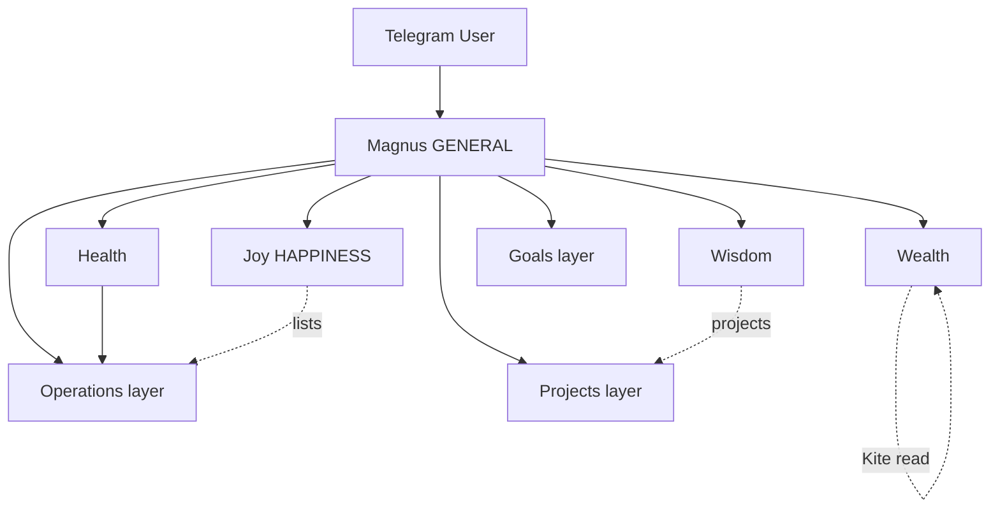

# Architecture Coherence — Magnus v1 Target State

**Purpose:** Define what "coherent and streamlined architecture" means at PR #100.  
**Master plan:** [`V1_HARDENING_PLAN.md`](./V1_HARDENING_PLAN.md)  
**Update:** Mark sections **Current** vs **Target** as PRs land; **Frozen** at PR #100.

---

## 1. Frozen spine (Target — PR #100)

Every user turn follows this path. No undocumented bypasses.

```
Telegram update
    │
    ├─ /start, /help ──► telegram.ts (local, no LLM)
    │
    ▼
magnus.ts
    │  allowlist gate
    │  persist user message
    │  typing indicator
    ▼
magnusOrchestrator.ts
    │  PRELUDE (fixed order):
    │    1. win-condition pending (morning brief)
    │    2. reversible action ("undo this")
    │    3. project session prelude (no hijack)
    │    4. photo augment (vision)
    │  classify intent + routing hints
    │  load memory + pillar context
    ▼
parsePillarExecutionPlan (Haiku)
    │  steps[] from capability catalog (1–4 default)
    ▼
executePillarPlan (sequential)
    │  GENERAL → magnusAgent tools | day_overview | pillar_consultation
    │  HEALTH  → deterministic gates → health executors
    │  WEALTH / HAPPINESS / WISDOM → pillarSpecialist (prompt-only + data inject)
    ▼
composePillarPlanReply (Haiku)     [skip if pillar_compose: false]
    ▼
accountabilityAgent
    │  action integrity
    │  action_ledger metadata
    │  finalizeMagnusVoice
    ▼
magnus.ts → persist assistant → chunk HTML → send
```

**Proactive (parallel):** `proactive/cron.ts` → job runners → `outbound.ts` → same chat persistence with `message_type=automated`.

---

## 2. Ownership model (Frozen)

| Layer | Owner | Executes |
|-------|-------|----------|
| Cross-pillar operations | Magnus (`GENERAL`) | `magnusAgent.ts` tool loop |
| Health domain judgment | Health pillar | `healthRouter` + executors |
| Wealth domain judgment | Wealth pillar | `wealthAgent` + Kite context |
| Wisdom domain judgment | Wisdom pillar | `wisdomAgent` prompt |
| Joy domain judgment | Joy pillar (`HAPPINESS`) | `happinessAgent` prompt |
| Trust / voice | Accountability | `accountabilityAgent.ts` |
| Activity: Operations | Cross-pillar | `magnus_events`, lists, calendar, reminders |
| Activity: Goals | Cross-pillar | `goals` table, `goal_manage` |
| Activity: Projects | Cross-pillar | `projects` + FSM, not a sixth pillar |

---

## 3. Streamlining decisions (enforce during hardening)

| Topic | Rule | Status |
|-------|------|--------|
| Intents | Exactly five: `GENERAL`, `HEALTH`, `WEALTH`, `HAPPINESS`, `WISDOM` | Current |
| `GENERAL` | Magnus lane, not fallback bucket | Current |
| Tools | Only `magnusAgent.ts` defines tools; catalogs filter subsets | Current |
| Meal log | One path: intake parser → pipeline → compose; explicit `meal:` gate only | Target |
| Meal plan vs log | `mealPlanVsLog.ts` rules in all nutrition paths | Target |
| Holistic day | `day_overview` executor only — not calendar tool + glue | Target |
| Morning brief | Shares context builder with day_overview where possible | Target |
| Brief + calendar | Brief reads Google Calendar when connected | **Gap → PR #94** |
| LifeOS memory | Enable for owner when data exists; no empty noise | **Gap → PR #92/97** |
| Hevy context | `formatHevyContext` only — no duplicate formatters | Target |
| Gym reconcile | `gymHevyReconcile.ts` shared by cron and inline | Current |
| Lists write | `listService.ts` canonical; Notion mirror secondary | Target |
| Compose | Default on; bypass list explicit in code comments | Current |
| OAuth | Unified Google for Calendar + YouTube; aliases documented | Current |
| Project setup | `projectSessionPrelude` — no hijack of unrelated turns | Target |

---

## 4. Known duplicate paths to eliminate (audit during PRs)

| Area | Risk | Action | PR |
|------|------|--------|-----|
| Morning brief context vs day_overview | Duplicate fetches | Extract shared `buildDayContext()` | #94 |
| Health journal vs `log_note` | User confusion | Document boundary; distinct prompts | #96 |
| `project_shipping` (Wisdom) vs `project_setup` (GENERAL) | Routing ambiguity | Document in catalogs + USER_QUERY_GUIDE | #98 |
| `connect_google` / `connect_calendar` / `connect_youtube` | Alias sprawl | Keep aliases; document in magnus.md only | #91 |
| LifeOS write without read | Context gap | Flip `MAGNUS_LIFEOS_CONTEXT_ENABLED` for owner | #92 |
| List recommend via JSONB `extra` only | Weak Joy surface | Rich schemas per archetype | #97 |

---

## 5. Data flow coherence

```
Telegram user id
    → user_profile.telegram_chat_id
    → user_profile.id (UUID)
    → all domain tables (user_profile_id FK)

Writes (app):
    user_profile, magnus_chat_messages, magnus_daily_logs, magnus_events,
    meal_logs, meal_plan_*, user_health_profile, user_program_memory,
    user_integrations, memory_summaries, projects, features, project_sessions,
    magnus_youtube_*, magnus_user_lists, magnus_proactive_subscriptions

Reads (LifeOS — enable for v1 close):
    goals, pillar_status, happiness_reserve, patterns, magnus_event_activity_stats
```

**RLS:** `service_role_only` — app uses service role key; per-user isolation in application layer.

---

## 6. Proactive architecture (Frozen)

```
cron (every N min)
    → morningBriefJob
    → eventReminderJob
    → gymHevyReconcileJob
    → nutritionNightlyJob
    → proactiveSubscriptionsJob → dispatcher → kind handlers
        → guards (quiet hours, daily cap)
        → llm/gateAndCompose (selected kinds)
        → outbound Telegram (HTML)
        → magnus_chat_messages (automated)
```

**Registry:** `proactive/kinds/registry.ts` — single registration point.

---

## 7. Test architecture (Frozen at v1)

| Layer | What it proves |
|-------|----------------|
| Unit tests | Store logic, parsers, gates, formatters |
| `catalogIntegrity.test.ts` | Tools ↔ capability catalogs |
| `userQueryRouting.test.ts` | 158 queries → routing signals |
| `chatMessageTestSuite.test.ts` | 1000 NL messages structural |
| `magnusGoldenPath.test.ts` | 100 end-to-end wiring scenarios |
| Manual owner sim | Real Telegram + integrations (PR #100) |
| Live E2E | **Not required for v1** — defer v2 |

---

## 8. Architecture freeze checklist (PR #100)

- [ ] Spine diagram matches code (this doc updated)
- [ ] No orphaned production files (`import-graph.mts` zero orphans)
- [ ] All streamlining decisions marked **Current** or explicitly deferred v2
- [ ] `docs/ARCHITECTURE.md` aligned with this doc (no stale intents)
- [ ] `TOOLS_AND_AGENTS.md` matches tool inventory
- [ ] Duplicate paths eliminated or documented as intentional aliases

---

## 9. Diagram — four pillars + activity layer



---

**Last updated:** 2026-08-16 · **Freeze target:** PR #100
