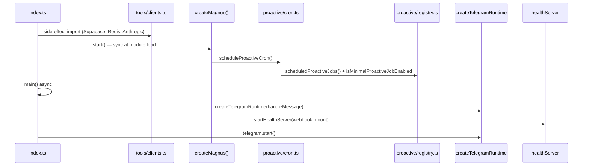
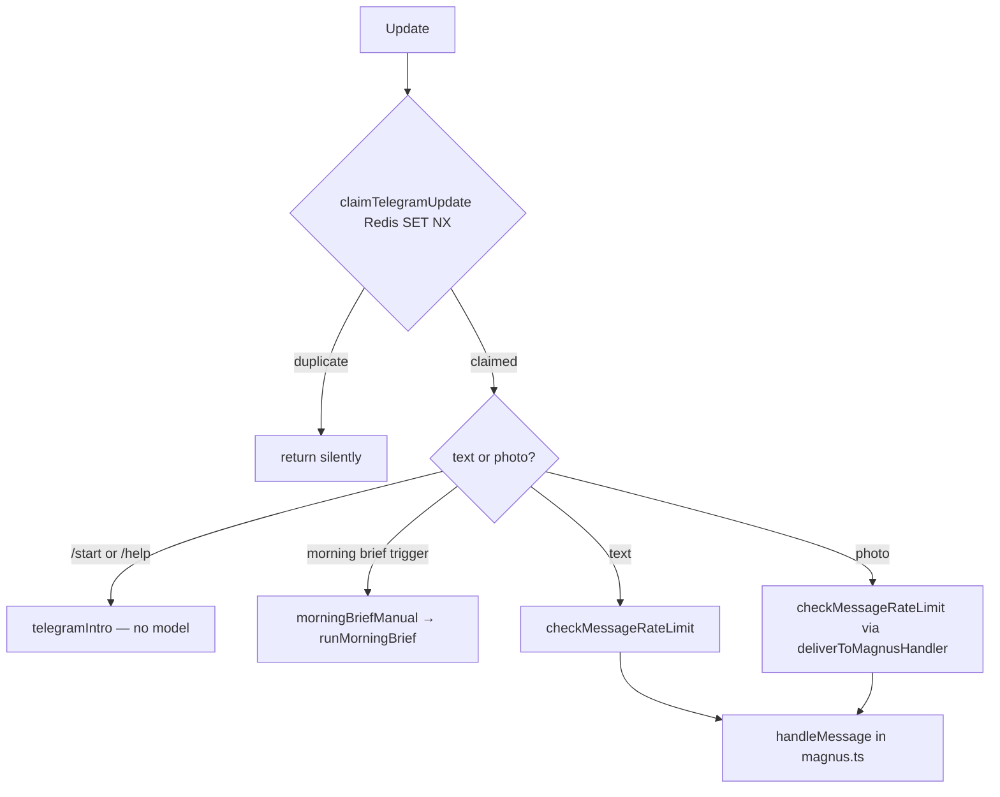
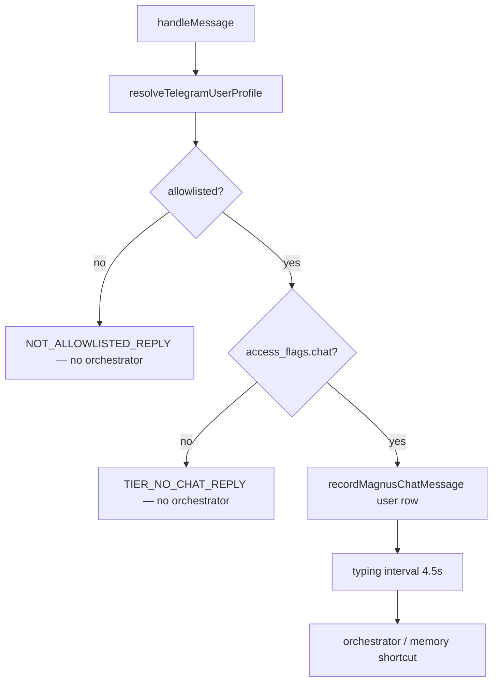

# Minimal mode journey log — Phase A

**Review plan:** [`MINIMAL_MODE_JOURNEY_REVIEW_PLAN.md`](./MINIMAL_MODE_JOURNEY_REVIEW_PLAN.md)

---

## Session A1 — Stages 0–2: Ingress trustworthy (complete)

**Started:** 2026-09-12  
**Completed:** 2026-09-12  
**Scope:** Process boot → Telegram ingress → access gate + persist user turn

### Trace confirmed

#### Stage 0 — Process boot



- **Entry:** `src/index.ts` → `createMagnus().start()` (sync, before `main()`) → `scheduleProactiveCron()`
- **Boot order:** dotenv → clients (fail-fast) → capability log → Telegram runtime → health HTTP → watchdog
- **Minimal fence:** `proactive/registry.ts` wraps each job's `enabled()` with `isMinimalProactiveJobEnabled(job.id)` — `nutrition_nightly` excluded

#### Stage 1 — Telegram ingress



- Dedupe runs **before** any DB write or orchestrator call
- `/start` and `/help` answered locally; morning brief bypasses orchestrator and calls shared `runMorningBrief`
- Photos pass `mealPhoto: { fileId, caption }` into `handleMessage`

#### Stage 2 — Access gate + persist



- Refusal paths return before chat log user row **and** before orchestrator
- Failed user-message persist logs warn only; turn still proceeds
- Minimal-mode timeout/error copy differs from full mode (`magnus.ts` catch block)

### Files reviewed

**Stage 0**

- [x] `index.ts` — clean boot spine; proactive cron scheduled at module load (L19–20) before async `main()`
- [x] `env.ts` — rate limit default 30/min; health port from `HEALTH_PORT`/`PORT`
- [x] `logger.ts` — pino JSON; Telegram id masked in production
- [x] `magnus.ts` `createMagnus()` — only calls `scheduleProactiveCron()`
- [x] `config/magnusCapabilities.ts` — boot log merges `minimalModeLogFields()` via `capabilityLogFields()`
- [x] `config/minimalMode.ts` — 6 live proactive jobs; `nutrition_nightly` not in set
- [x] `healthServer.ts` — `/health`, `/ready` (Redis ping + Supabase head), OAuth callbacks, webhook immediate 200 + async handler
- [x] `tools/clients.ts` — fail-fast on missing Redis/Supabase/Anthropic; production requires service role
- [x] `proactive/cron.ts` — boot tick runs immediately after schedule; jobs filtered by `enabled()`
- [x] `proactive/registry.ts` — all 7 jobs registered; minimal wrapper gates `nutrition_nightly`

**Stage 1**

- [x] `tools/telegram.ts` — dedupe, local commands, morning brief shortcut, rate limit, photo handler
- [x] `tools/rateLimit.ts` — fixed 60s window; Redis fail-open configurable
- [x] `config/telegramRuntime.ts` — polling vs webhook resolution; handler timeout default 5 min
- [x] `config/telegramCommands.ts` — exactly `/start` and `/help`
- [x] `magnus/telegramIntro.ts` — minimal-mode copy for live features
- [x] `proactive/morningBriefManual.ts` — shared `runMorningBrief` with cron path
- [x] `config/security.ts` — `redisGuardFailOpen()` defaults fail-closed in production

**Stage 2**

- [x] `magnus.ts` `handleMessage` — gates, persist, typing, timeout, minimal error copy
- [x] `tools/chatLog.ts` — profile resolve/create; `recordMagnusChatMessage`
- [x] `tools/chatMessageTypes.ts` — conversation vs automated field helpers

### Issues found

| ID | Severity | File:line | Issue | Proposed fix |
|----|----------|-----------|-------|--------------|
| A1-001 | **medium** | `magnus/telegramIntro.ts:24,73` | Minimal `/start` and `/help` say **Notion is parked**, but `MINIMAL_GENERAL_CAPABILITIES` and `MINIMAL_MAGNUS_TOOL_NAMES` include Notion (`connect_notion`, list mirror, `notion_list_sync` job). Users are told a live feature is unavailable. | Remove Notion from the parked lists; mention optional Notion mirror alongside lists (matches `magnusCapabilities.notionCapability`). |
| A1-002 | low | `magnus/telegramIntro.test.ts:27,32` | Intro tests assert full-mode copy (`"no commands"`, pillar cues Health/Money/…) but do not run under `MAGNUS_MINIMAL_MODE=true`. Minimal copy regressions would not fail CI. | Add a `describe` block with `MAGNUS_MINIMAL_MODE=true` asserting minimal cues and that Notion is **not** listed as parked (after A1-001). |
| A1-003 | low | `tools/telegram.ts:258–263` | `/start` and `/help` skip rate limit and chat-log persist (unlike morning-brief trigger). Acceptable for onboarding; worth documenting as intentional. | No code change — note in module comment or accept as-is. |
| A1-004 | low | `config/magnusCapabilities.ts:399` | `telegram:check` still lists **meals** and **Zerodha** when minimal mode is on. Not wrong (shows env readiness) but can confuse operators expecting a stripped checklist. | Optional: tag rows `[parked in minimal]` or hide off-capability rows when `minimalMode`. |
| A1-005 | info | `healthServer.ts:286–379` | Zerodha OAuth routes remain mounted at boot; wealth intent is parked at routing layer only. Safe for Phase A; re-verify fence in Session A15 / Phase B. | No change in Phase A. |

### Optimizations noted (no change this session)

- Webhook path acks immediately (`healthServer.ts` L48–54) before agent turn — good for Telegram retry safety; dedupe absorbs duplicates.
- `proactive/cron.ts` L59–62 boot tick avoids up-to-5-minute delay after deploy for subscription reconciliation.
- `resolveTelegramUserProfile` auto-creates rows on first message (`chatLog.ts` L128–156); refusal still blocks orchestrator but profile row exists — documented behaviour for admin allowlisting.

### Exit criteria

| Criterion | Status |
|-----------|--------|
| `npm run telegram:check` shows minimal scope | **pass** — with `MAGNUS_MINIMAL_MODE=true`, reports minimal mode + Phase 1 routing (core env vars missing in dev agent VM is expected) |
| Cron lists only `MINIMAL_PROACTIVE_JOBS` when minimal | **pass** — `minimalMode.test.ts` asserts 6 enabled / `nutrition_nightly` false; registry wraps at runtime |
| Duplicate webhook retry never double-replies | **pass** — Redis `SET NX` 24h TTL before handler; fail-closed in production by default |
| Rate limit message user-safe | **pass** — includes `retryAfterSec` |
| `/start` and `/help` never call orchestrator | **pass** — local `telegramIntro` only |
| Refusal paths never call orchestrator | **pass** — early return in `handleMessage` before persist+orchestrator |
| Every successful turn has user row in chat log | **pass** — `recordMagnusChatMessage` before orchestrator; warn-only on failure |

### Verification run

```bash
MAGNUS_MINIMAL_MODE=true npm run telegram:check   # minimal scope OK (core env missing in agent VM)
npm test -- src/config/minimalMode.test.ts        # 10 passed
npm test -- src/magnus/telegramIntro.test.ts      # 5 passed (full-mode default only)
```

### Next session

**A2 — Stages 3–4:** Memory command shortcuts + orchestrator FSM preludes (`memoryTopicCommands`, FSM prelude modules in orchestrator).
