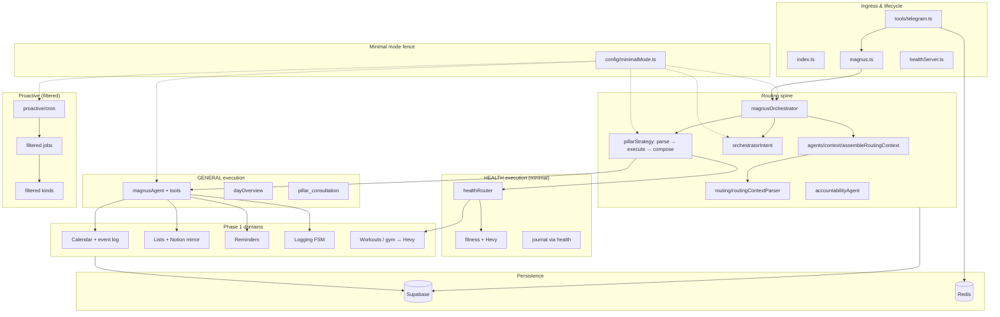
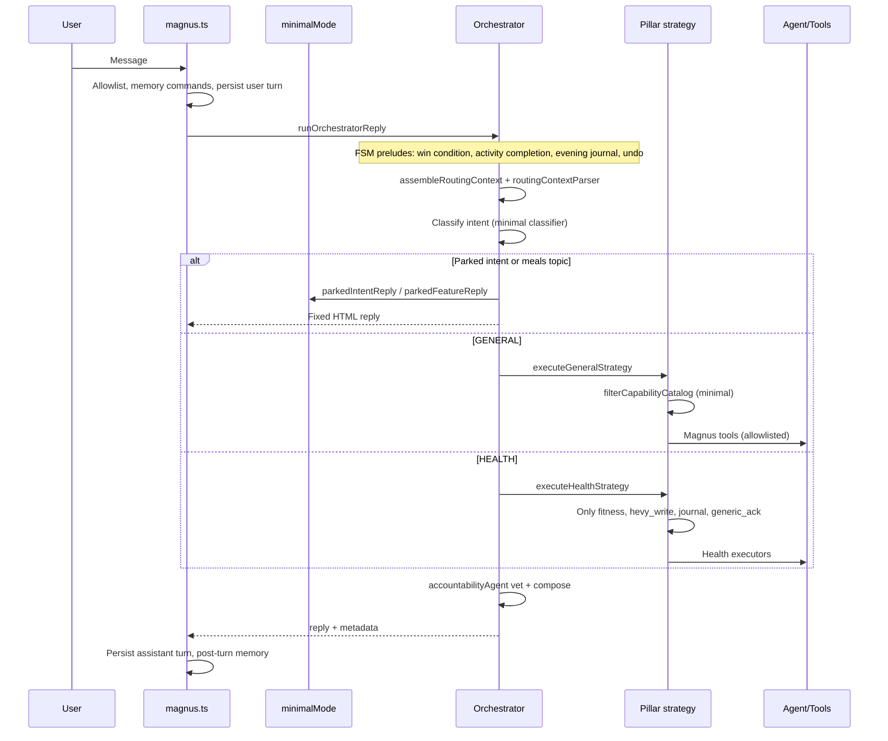
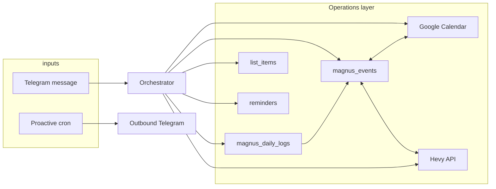

# Magnus minimal mode — modular architecture map

**Purpose:** Module-by-module review guide for tightening minimal mode (`MAGNUS_MINIMAL_MODE=true`).  
**Companion:** `MINIMAL_MODE_JOURNEY_REVIEW_PLAN.md` (two-phase review: **Phase A** minimal MVP → **Phase B** parked in production), `docs/product/MINIMAL_MODE_FOCUS.md`, `src/config/minimalMode.ts`, `magnus.md` § Minimal mode  
**Last updated:** 2026-09-12

---

## Review phases

| Phase | When | Focus |
|-------|------|-------|
| **A — Minimal MVP** | Now | Live user journeys only (stages 0–12, branches B1–B6, proactive live, MVP gate) |
| **B — Parked in production** | After MVP gate | Meals, nutrition, pillars, projects — code in the image but runtime-gated |

See journey plan for session schedules **A1–A15** and **B0–B8**.

---

## What minimal mode is

Minimal mode is a **scope fence**, not a separate codebase. The same Node process runs; `src/config/minimalMode.ts` filters:

| Filter | What it gates |
|--------|----------------|
| `MINIMAL_GENERAL_CAPABILITIES` | GENERAL plan-parser catalog |
| `MINIMAL_HEALTH_CAPABILITIES` | HEALTH plan-parser catalog |
| `MINIMAL_MAGNUS_TOOL_NAMES` | Magnus agent tool loop |
| `MINIMAL_PROACTIVE_JOBS` | Cron jobs |
| `MINIMAL_PROACTIVE_KINDS` | Subscription catalog kinds |
| `PARKED_INTENTS` | WEALTH / HAPPINESS / WISDOM → parked reply |
| `parked_feature_topic` | meals (and meal photos) → parked reply |

**Phase 1 focus (perfect these):** workouts, calendar, lists, reminders, logging.  
**Phase 2 (parked):** meals, nutrition, full pillar depth, projects, LifeOS joy tank.

---

## 1. System diagram — minimal mode layers



---

## 2. Request path (minimal mode)



---

## 3. Module catalog

Production TypeScript under `src/` is ~**54k lines** (excluding tests). Below: **live in minimal mode** modules first, then cross-cutting, then parked.

### Legend

| Column | Meaning |
|--------|---------|
| **Lines** | Approx. non-test `.ts` lines in folder |
| **Gate** | How minimal mode affects this module |
| **Review priority** | Suggested order for tightening |

---

### A. Scope fence (start here)

| Module | Purpose | Key files | Lines | Gate |
|--------|---------|-----------|-------|------|
| **minimalMode** | Single source of truth for what is live vs parked | `config/minimalMode.ts`, `minimalMode.test.ts`, `minimalMode.parkedTopic.test.ts` | ~350 | Defines all allowlists |
| **magnusCapabilities** | Boot + `telegram:check` capability report | `config/magnusCapabilities.ts` | ~750 | Reports minimal scope |
| **pillarPhilosophy** | Intent definitions; marks parked pillars | `agents/pillarPhilosophy.ts` | ~120 | `isParkedIntent` |
| **magnusCorePrompt** | System prompt fragment for minimal tools | `agents/magnusCorePrompt.ts` | ~220 | `MINIMAL_MODE_SYSTEM` |

**Review questions:** Are allowlists complete? Do parked replies name live features correctly? Any full-mode capability leaking through catalogs?

---

### B. Ingress & lifecycle

| Module | Purpose | Key files | Lines | Gate |
|--------|---------|-----------|-------|------|
| **Boot** | Wire Telegram, health HTTP, cron, shutdown | `index.ts`, `env.ts`, `logger.ts` | ~150 | None |
| **Turn handler** | Gates, persistence, orchestrator, chunking | `magnus.ts` | ~260 | Starts proactive cron |
| **Telegram** | Webhook/poll, dedupe, rate limit, `/start` `/help` | `tools/telegram.ts`, `rateLimit.ts`, `config/telegramRuntime.ts`, `config/telegramCommands.ts`, `tools/telegramWatchdog.ts` | ~1,655 | None |
| **Presentation** | HTML chunking, intro copy | `magnus/telegramFormat.ts`, `telegramChunk.ts`, `telegramIntro.ts` | ~294 | Intro text differs in minimal |
| **Health HTTP** | `/health`, `/ready`, OAuth callbacks, webhook | `healthServer.ts` | ~400 | OAuth for Google/Notion |

---

### C. Routing spine (cross-cutting — high leverage)

| Module | Purpose | Key files | Lines | Gate |
|--------|---------|-----------|-------|------|
| **Orchestrator** | Turn preludes, classify, route, finalize voice | `agents/magnusOrchestrator.ts` | ~490 | Parks intents/meals; skips project prelude |
| **Intent classifier** | Five-way LLM classify | `agents/orchestratorIntent.ts`, `intent.ts` | ~280 | `MINIMAL_CLASSIFY_SYSTEM` |
| **Routing context** | Frontload identity, FSM, growth snapshot | `agents/context/*` | ~1,457 | Growth feeds adherence signals |
| **Routing parser** | Haiku structural signals + parked topics | `agents/routing/routingContextParser.ts`, `intentRoutingHints.ts` | ~600 | `parked_feature_topic: meals` |
| **Pillar strategy** | Parse → execute → compose pipeline | `agents/routing/pillarStrategy/*` | ~3,500 | `filterCapabilityCatalog` on catalogs |
| **Catalogs** | Capability IDs per pillar | `pillarStrategy/catalogs/*.ts` | ~600 | Filtered at runtime |
| **Accountability** | Action ledger, false-save guard, voice | `routing/accountabilityAgent.ts`, `actionIntegrity.ts` | ~400 | Always on |
| **Compose** | Re-voice step outputs | `composePillarPlanReply.ts`, `finalizeMagnusVoice.ts` | ~500 | Always on |
| **Consultation** | Multi-pillar parallel (Health only in minimal) | `executePillarConsultation.ts`, `consultationMagnusTools.ts`, `consultationOutcome.ts` | ~600 | `filterConsultablePillars` → HEALTH only |
| **Reversible actions** | Meal undo (parked in minimal for meals; pattern remains) | `reversibleAction.ts`, `handleReversibleAction.ts` | ~200 | Undo prelude still runs |

---

### D. Phase 1 — Workouts (~1,700 lines live)

| Submodule | Purpose | Files |
|-----------|---------|-------|
| **Health router** | Plan parser + capability dispatch | `agents/health/healthRouter.ts`, `healthSubIntent.ts` |
| **Health executors** | Step runners; minimal gates meal paths | `routing/pillarStrategy/executeHealthPlanStep.ts`, `healthDeterministicGates.ts` |
| **Fitness agent** | Training coaching + Hevy read context | `pillars/health/workouts/agents/fitnessAgent.ts` |
| **Hevy write** | Routine/workout writes from NL | `pillars/health/workouts/agents/hevyWriteAgent.ts`, `hevy/parseHevyWriteCommand.ts` |
| **Hevy client** | REST API, format for prompts | `pillars/health/workouts/hevy/hevyClient.ts`, `formatHevyContext.ts`, `workoutVolume.ts` |
| **Weekly schedule** | Mon-first program memory injection | `pillars/health/workouts/weeklySchedule.ts` |
| **References** | Program memory + journal blocks | `pillars/health/references/*` |
| **Gym ↔ Hevy** | Match planned gym events to Hevy sessions | `events/gymHevyMatch.ts`, `gymHevyReconcile.ts` |
| **Proactive reconcile** | Cron 3h after gym time | `proactive/jobs/gymHevyReconcileJob.ts` |
| **Drift guard** | Routine slippage nudge | `proactive/kinds/driftGuard.ts` |

**Minimal capabilities:** `fitness`, `hevy_write`, `journal`, `generic_ack`  
**Parked:** all `meal_*`, `energy`, `nutrition_advice`, `long_term_planning`, `alternates`

---

### E. Phase 1 — Calendar (~2,800 lines)

| Submodule | Purpose | Files |
|-----------|---------|-------|
| **Calendar tool** | read/create/update/delete; read-before-write | `agents/tools/calendarTool.ts`, `routing/readBeforeWrite.ts` |
| **Google Calendar** | OAuth + API ops | `integrations/googleCalendar/*`, `integrations/google/oauthFlow.ts` |
| **Event log tool** | log/update/reschedule/list commitments | `agents/tools/eventLogTool.ts` |
| **Event domain** | Store, types, time, format | `events/eventStore.ts`, `eventTypes.ts`, `eventTime.ts`, `formatEvents.ts` |
| **Calendar sync** | Link `magnus_events` ↔ Google | `events/calendarEventSync.ts` |
| **Day context** | Shared snapshot for brief + day_overview | `day/buildDayContext.ts`, `detectDayConflicts.ts` |
| **Day overview** | GENERAL capability executor | `routing/pillarStrategy/dayOverview.ts` |
| **Completion reconcile** | Journal text → event status | `events/eventCompletionReconcile.ts` |

**Minimal capabilities:** `calendar`, `event_log`, `day_overview`  
**Default reminder lead:** `MAGNUS_DEFAULT_EVENT_REMINDER_LEAD_MINUTES` (30)

---

### F. Phase 1 — Lists (~4,100 lines)

| Submodule | Purpose | Files |
|-----------|---------|-------|
| **List tool** | Magnus tools: catalog, items, CRUD, recommend | `agents/tools/listTool.ts` |
| **List service** | Catalog templates, orchestration | `lists/listService.ts`, `listCatalog.ts`, `listStore.ts`, `listSlug.ts` |
| **Notion mirror** | Optional bidirectional sync | `lists/listNotionMirror.ts`, `integrations/notion/notionListSync.ts` |
| **Notion connect** | OAuth, provision hub, setup | `agents/tools/notionConnectTool.ts`, `integrations/notion/notionProvision.ts`, `notionSetup.ts` |
| **Notion sync job** | Daily scheduled reconcile | `proactive/jobs/notionListSyncJob.ts` |
| **Stale list nudge** | Proactive kind (14+ days idle) | `proactive/kinds/staleListNudge.ts`, `signals/listNudgeSignals.ts` |
| **LifeOS goal** | `add_goal` still allowlisted | `lifeos/lifeosStore.ts`, `lifeosTool.ts` (partial) |

**Minimal tools:** `list_*`, `connect_notion`, `setup_notion`, `sync_notion`, `link_notion_list`, `add_goal`  
**Parked GENERAL capabilities:** `lifeos` (joy tank), `project_*`, `goal_manage` (except add_goal tool)

---

### G. Phase 1 — Reminders (~1,200 lines in tools + proactive)

| Submodule | Purpose | Files |
|-----------|---------|-------|
| **Manage reminders tool** | create/list/snooze/cancel/recurring | `proactive/manageRemindersTool.ts` |
| **Reminder store** | Persistence + matching | `proactive/reminderStore.ts`, `reminderMatch.ts`, `parseReminderTime.ts` |
| **Event reminders** | `remind_at` on `magnus_events` | `proactive/jobs/eventReminderJob.ts` |
| **Custom reminders** | Subscription kind + one-shot expiry | `proactive/kinds/customReminder.ts`, `oneShotReminderExpiry.ts` |
| **Proactive tool** | Enable/disable rhythm kinds | `proactive/manageProactiveTool.ts` |

**Minimal capabilities:** `reminders`, `proactive`  
**Minimal kinds:** includes `custom_reminder`; excludes all `meal_*` kinds

---

### H. Phase 1 — Logging (~2,500 lines)

| Submodule | Purpose | Files |
|-----------|---------|-------|
| **Logging framework** | Daily status, FSM types | `logging/dailyLogStatus.ts`, `types.ts`, `loggingDeclined.ts` |
| **Morning win** | Post-brief intention loop | `jobs/winConditionPending.ts`, `handleWinConditionPending.ts` |
| **Evening journal** | FSM: engage → collect → confirm → save | `logging/eveningJournalPending.ts`, `handleEveningJournalPending.ts`, `parseEveningDraft.ts` |
| **Activity completion** | Post-event done/missed/skip/postpone | `logging/activityCompletionPending.ts`, `handleActivityCompletionPending.ts`, `activityCompletionParser.ts` |
| **Journal note tool** | `log_note` → daily logs | `agents/tools/logNoteTool.ts` |
| **Daily checkin tools** | read/write check-in | `agents/tools/dailyLogReadTool.ts`, `lists/logDailyCheckin` via listService |
| **Proactive evening** | `evening_journal`, `evening_log_followup` | `proactive/kinds/eveningJournal.ts`, `eveningLogFollowup.ts` |
| **Activity completion job** | Cron nudge after planned end + grace | `proactive/jobs/activityCompletionJob.ts` |
| **Rhythm summaries** | Week/month cadence | `proactive/rhythm/*` |

**Minimal capabilities:** `journal_note`, `daily_checkin`  
**Supporting tables:** `magnus_daily_logs`, checkins list

---

### I. Supporting (live, not Phase 1 focus)

| Module | Purpose | Key files | Lines |
|--------|---------|-----------|-------|
| **YouTube** | Search, playlists, bookmarks, cue | `agents/tools/youtubeTool.ts`, `youtubeConnectTool.ts`, `youtube/*`, `integrations/youtube/*` | ~1,650 |
| **Morning brief** | Proactive + manual trigger | `jobs/morningBrief*.ts`, `proactive/jobs/morningBriefJob.ts`, `morningBriefManual.ts` | ~1,200 |
| **Memory** | Load, topics, embeddings, recall | `agents/memory/*` | ~3,429 |
| **Magnus agent** | Tool loop for GENERAL | `agents/magnusAgent.ts` | ~800 |
| **Vision** | Non-meal photos (lists, docs) — meal photos parked | `vision/*` | ~299 |
| **Users** | Integrations + program memory | `users/userIntegrations.ts`, `userProgramMemory.ts` | ~211 |
| **Chat persistence** | Messages, profile resolution | `tools/chatLog.ts`, `chatMessageTypes.ts` | incl. in tools/ |

---

### J. Proactive system (filtered — ~6,400 lines total, ~half live)

**Live jobs** (`MINIMAL_PROACTIVE_JOBS`):

| Job ID | File |
|--------|------|
| `morning_brief` | `jobs/morningBriefJob.ts` |
| `event_reminder` | `jobs/eventReminderJob.ts` |
| `activity_completion` | `jobs/activityCompletionJob.ts` |
| `gym_hevy_reconcile` | `jobs/gymHevyReconcileJob.ts` |
| `proactive_subscriptions` | `jobs/proactiveSubscriptionsJob.ts` |
| `notion_list_sync` | `jobs/notionListSyncJob.ts` |

**Parked jobs:** `nutrition_nightly`

**Live kinds** (`MINIMAL_PROACTIVE_KINDS`): `evening_journal`, `evening_log_followup`, `drift_guard`, `custom_reminder`, `week_planning`, `weekly_wrap`, `monthly_goal_review`, `midday_encouragement`, `stale_list_nudge`, `chat_inactivity`

**Parked kinds:** all `meal_*`, `project_conflict_review`

**Core infrastructure:** `proactive/cron.ts`, `dispatcher.ts`, `registry.ts`, `outbound.ts`, `guards.ts`, `dedupe.ts`, `subscriptions/*`, `llm/gateAndCompose.ts`

---

### K. Parked in minimal mode (review only for leaks)

| Area | Lines (approx.) | Why parked |
|------|-----------------|------------|
| **Meals / nutrition** | `meals/*` ~3k, `nutrition/*` ~4k, health meal agents | Phase 2 |
| **Wealth / Zerodha** | `agents/wealth/*`, `pillars/wealth/zerodha/*` | Pillar parked |
| **Happiness / Wisdom** | `agents/happiness/*`, `agents/wisdom/*` | Pillars parked |
| **Projects** | `projects/*` ~1.5k | Not Phase 1 |
| **LifeOS depth** | joy tank, pillar status reads | Partial; `add_goal` tool live |
| **Health onboarding** | `healthOnboarding.ts` | Skipped when `isMinimalMode()` |
| **Meal proactive** | `proactive/kinds/meal*.ts` | Phase 2 |

**Leak check:** Grep for paths that bypass `minimalMode.ts` filters (direct tool registration, unfiltered catalogs, full classifier).

---

## 4. Data flow — Phase 1 domains



---

## 5. Suggested review order

Use **`MINIMAL_MODE_JOURNEY_REVIEW_PLAN.md`** for the authoritative schedule. Summary:

**Phase A (minimal MVP):** fence → spine → Phase 1 domains → proactive → supporting → MVP gate.  
**Phase B (parked in production):** B0 fence integrity → meals → meal proactive → health depth → projects → pillars → LifeOS → full-mode staging.

| Phase | Sessions | Parked code |
|-------|----------|-------------|
| A | A1–A15 | Fence smoke only (A15) — no deep domain review |
| B | B0–B8 | Full line review of gated domains (~90+ files) |

---

## 6. Per-module review checklist

Use this for each module in the order above.

### 6.1 Scope

- [ ] Module is **live** in minimal mode (or explicitly parked with no execution path)
- [ ] All entry points go through `minimalMode.ts` filters (or are intentionally exempt)
- [ ] Tests include minimal-mode cases (`minimalMode.test.ts`, accuracy suite)

### 6.2 Correctness

- [ ] Happy path works end-to-end (tool → DB → reply)
- [ ] Error paths return user-safe messages (no stack traces, no host env hints)
- [ ] Idempotency where needed (dedupe, update_id, reminder delivery)
- [ ] Timezone handling uses `user_profile.timezone`

### 6.3 Adherence / Phase 1 goal

> Is the user sticking to their plan, or are commitments failing?

- [ ] Writes update the right source of truth (`magnus_events.status`, check-ins, Hevy)
- [ ] Reads reflect DB state (no LLM-invented calendar events or lists)
- [ ] Closure paths exist (activity completion, gym ↔ Hevy, evening journal)

### 6.4 Voice & integrity

- [ ] `actionIntegrity` — no false "saved" claims
- [ ] `accountabilityAgent` runs at orchestrator exit
- [ ] `pillar_compose: false` only on deterministic/terminal replies
- [ ] Parked features use `parkedFeatureReply()` wording

### 6.5 Code quality

- [ ] No dead code in module (run `npx tsx scripts/dev/import-graph.mts`)
- [ ] Matches surrounding conventions (naming, types, error handling)
- [ ] Comments only where non-obvious
- [ ] Line-by-line pass: every branch justified or removed

---

## 7. Verification commands

```bash
# Minimal mode unit tests
npm test -- src/config/minimalMode

# Full test suite (set CI env vars)
npm test

# Minimal-mode accuracy scenarios
npm run test:accuracy

# Dead code audit
npx tsx scripts/dev/import-graph.mts

# Capability report
npm run telegram:check
```

---

## 8. Next step

**Phase A:** Session **A1** (`config/minimalMode.ts` + stages 0–2) or a Phase 1 branch (A6–A10).  
**Phase B:** Only after MVP gate — start **B0** (fence integrity).

See `MINIMAL_MODE_JOURNEY_REVIEW_PLAN.md` for MVP gate criteria and Phase B domain catalog.
